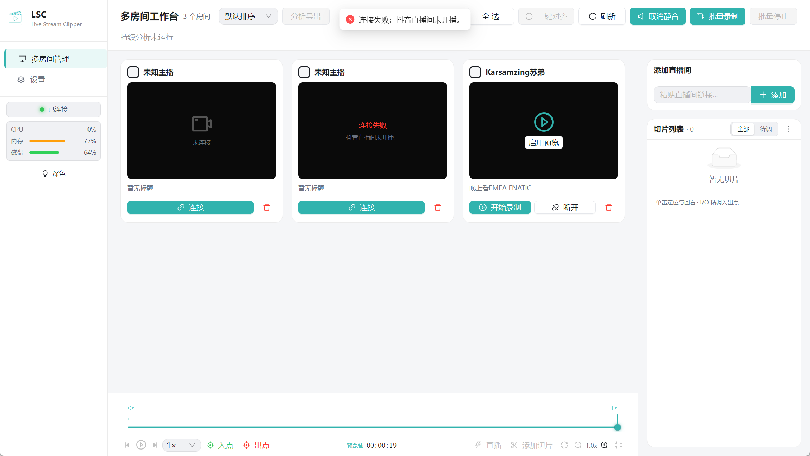
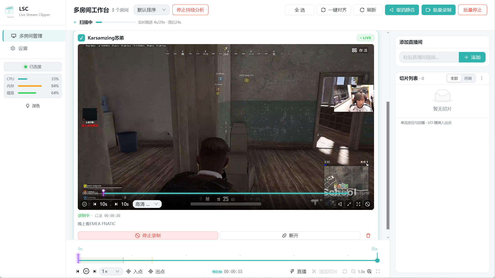
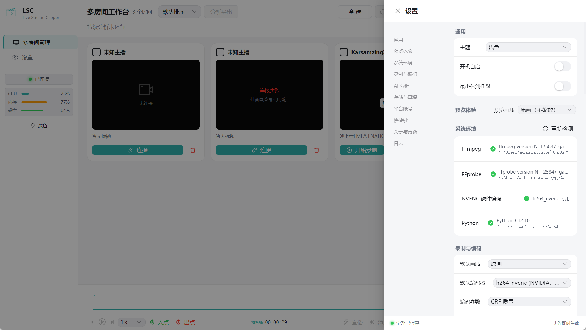
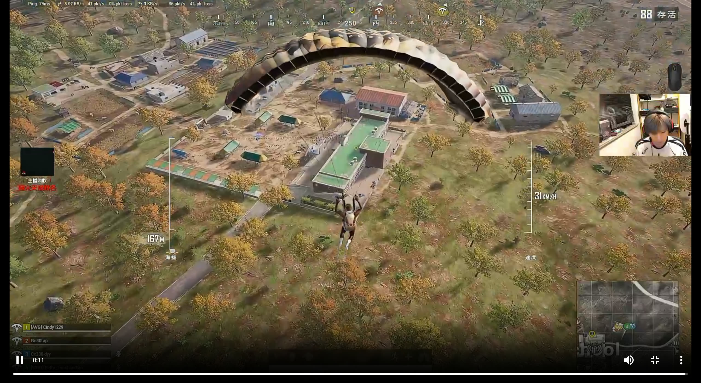

# 🎬 Live Stream Clipper (LSC 直播切片)

> 多直播间**录制 + 切片**一体化工具 —— 同时录制多视角直播，跨房间同步预览，一键标记、对齐、批量导出精彩片段。


面向电竞 / 多视角直播场景：支持 **12 路并发录制**、**4 路并发预览**、墙钟精确切片、音频互相关多视角对齐，以及无畏契约（Valorant）等场景的 **AI 持续高光分析**，可一键生成剪映草稿继续精剪。

📦 下载安装包：[GitHub Releases](https://github.com/Lawrence7y/LSC/releases) · 📖 隐私说明：[PRIVACY.md](./PRIVACY.md)

---

## 📸 界面预览

### 多房间工作台

左侧房间列表（连接 / 录制 / 删除）、顶部批量操作（全选 / 一键对齐 / 批量录制）、右侧切片列表与添加直播间面板、底部同步时间线：



### 录制中状态

房间连接直播流后实时预览（MSE 低延迟），一键开始录制（已录时长实时统计）、启动 AI 持续分析（顶部"停止持续分析"按钮）：



### 设置中心

系统环境检测（FFmpeg / FFprobe / NVENC / Python 全绿可用）、通用 / 预览体验 / 录制与编码 / AI 分析 / 存储与草稿 / 平台账号 / 快捷键 / 关于与更新 / 日志，全部可视化配置：



### 全屏预览

沉浸式全屏观看直播（支持暂停 / 进度 / 音量 / 画质切换）：



---

## ✨ 特性总览

| 特性 | 说明 |
| :--- | :--- |
| 🎥 **多路并发录制** | 最多 **12 路** 同时录制；`copy` 直拷或 libx264 / NVENC / QSV / AMF 编码；断流自动重连 |
| 📺 **低延迟预览** | 最多 **4 路** MSE（fMP4）并发预览，压力升高自动降分辨率 / 帧率 |
| 🎯 **精确切片** | 按 `i` / `o` 标记入出点，墙钟时间映射录制文件，亚毫秒级对齐能力 |
| 🔀 **多视角一键对齐** | 预览流音频 FFT 互相关对齐，批量导出画面内容同步的多视角切片 |
| 🤖 **AI 持续高光分析** | Valorant 回合自动切割（OCR 权威边界），副房时间映射，人工确认后导出 |
| ✂️ **剪映衔接** | 一键生成剪映草稿（.draft），无缝继续精剪 |
| 📱 **竖屏导出** | 9:16 letterbox 等比缩放 + 补黑边，保留完整画面 |
| 🌐 **多平台支持** | 抖音 / B站 / 虎牙 / 斗鱼 / 快手 / 小红书 / 微博 / 直链 / 通用页面 |
| 🔐 **本地优先** | 无账户、无遥测，所有数据本地存储，敏感信息自动脱敏 |

---

## 🚀 快速开始

### 方式一：安装包（推荐）

- **Microsoft Store 版（自包含）**：从 Microsoft Store 安装 `Live Stream Clipper`。所有 Python 依赖与 FFmpeg 已内置在 MSIX 包中，首次启动无需联网下载或安装任何组件。
- **GitHub Releases 安装包**：从 [Releases](https://github.com/Lawrence7y/LSC/releases) 下载 `LSC 直播切片系统 Setup x.y.z.exe`。该安装包会在安装过程中下载运行依赖（国内镜像加速）并自动检测 / 升级 VC++ 运行库。

无论哪种方式，首次启动均可直接使用；若机器不支持 DirectML（如虚拟机），AI 分析自动降级 CPU，不影响录制。

### 方式二：开发模式

前置要求：**Python 3.10+**、**Node.js 18+**、FFmpeg（PATH 中）。

```bash
# 1. 后端依赖
pip install -r requirements.txt

# 2. 前端依赖
cd lsc-electron && npm install
```

```bash
# 一键拉起后端 + Electron
cd lsc-electron && npm run dev
```

仅调试后端 / 仅调试前端：

```bash
# 仅 Python 后端（WebSocket 服务，端口 9876）
cd python-backend && python main.py

# 仅前端 Vite（纯 UI 页面）
cd lsc-electron && npx vite --config vite.dev.config.ts
```

### 测试与代码检查

```bash
set QT_QPA_PLATFORM=offscreen
pytest -v                        # Python 测试套件
ruff check lsc/                  # Python 静态检查
cd lsc-electron && npx tsc --noEmit   # TypeScript 类型检查
```

---

## 🧭 使用指南

### 新手四步（应用内有引导）

| 步骤 | 操作 | 快捷键 |
| :--- | :--- | :--- |
| ① 添加房间 | 输入直播间链接，自动解析平台与画质 | — |
| ② 预览 / 录制 | 点击「预览」低延迟观看；点击「录制」落盘保存 | `r` 切换录制 |
| ③ 标记切片 | 播放到精彩处按 `i` / `o` 标记入出点，加入切片列表 | `i` / `o` |
| ④ 导出片段 | 选择切片点击「导出」（可先「一键对齐」多视角） | `Ctrl + e` |

### 全局快捷键

| 功能 | 快捷键 | 功能 | 快捷键 |
| :--- | :--- | :--- | :--- |
| 切换页面：工作台 / 设置 | `Ctrl+1` / `Ctrl+2` | 标记入点 / 出点 | `i` / `o` |
| 播放 / 暂停 | `Space` | 切换录制状态 | `r` |
| 静音 / 取消静音 | `m` | 全屏预览 | `f` |
| 批量开始录制 | `Ctrl+r` | 批量停止录制 | `Ctrl+Shift+r` |
| 多房间卡片全选 | `Ctrl+Shift+A` | 触发当前导出 | `Ctrl+e` |
| 刷新页面 | `F5` | | |

> 输入框聚焦时快捷键自动释放，不会误触发切片操作；`Ctrl` 组合键均不影响浏览器系统快捷键。

### 多视角对齐导出流程

```text
各房间预览 <video> ──► 捕获 8s 音频 (16kHz PCM)
        │
        ▼
后端 FFT 互相关 ──► 各房 content_offset（以进度最慢房间为基准）
        │
        ▼
公共时间轴建立 ──► 同时标记 i/o ──► 批量导出（墙钟映射 + offset）
```

---

## 🛠 核心功能详解

### 1. 录制引擎

- **编码**：`copy` 直拷（无损） / `libx264` / `libx265` / `h264_nvenc`（NVIDIA）/ `h264_qsv`（Intel）/ `h264_amf`（AMD）
- **磁盘满保护**：剩余空间 < 2GB 自动安全停录，防止系统与录制文件损毁
- **三层校验**：录制停止 / 重连时验证 路径存在 → 体积 > 0.1MB → 格式头（MP4 `ftyp` / FLV / MKV EBML）
- **智能重连**：网络抖动类错误自动重连，权限 / 磁盘类错误不重连并给出中文提示

### 2. 实时预览（MSE fMP4）

- 独立 FFmpeg 转码输出 fragmented MP4，WebSocket 分片推送，浏览器原生 `<video>` 播放
- 每片段约 1s，30fps 推送节奏；首帧 `init` 段 + 后续 `media` 段
- ≥3 路预览自动降为 ≤854×480@20fps，≥4 路降为 ≤640×360@15fps
- 断流自动重连（最多 3 次，指数退避），10s 无数据触发前端 watchdog

### 3. 切片与导出

- **墙钟映射**：`export_start = mark_in_wallclock - recording_start_mono - content_offset`，杜绝预览 / 录制双流延迟造成的偏移
- **全局导出队列**：并发上限 1 或 2，超限自动排队；随时可取消
- **导出选项**：转码 / 直拷、分辨率缩放、帧率、码率、竖屏 9:16、缩略图
- **失败兜底**：FFmpeg 底层报错自动转中文友好提示；提交失败回滚「排队中」状态

### 4. 多房间音频对齐

- 前端 Web Audio（AudioWorklet）从各房预览流捕获 **8 秒** PCM（16kHz mono float32）
- 后端 FFT 互相关（抛物线插值，亚毫秒精度）计算各房相对基准房的 `content_offset`
- **置信度防线**：相似度 < 0.3 判定内容不相关，自动降级 0 偏移，防止误对齐
- 对齐成功后建立公共时间轴，播放头 / 切片 / 进度条在同一坐标系

### 5. AI 持续高光分析（Valorant）

- **纯 OCR 架构**：顶部计分板 + 回合计时器 + 中央回合横幅（准备 / 结算关键词），1fps 双区域扫描
- **切片语义**：入点 = 交战阶段第一帧（交战钟 >45s 连续确认）；出点 = 下回合购买阶段第一帧
- **主房分析 → 副房映射**：只分析主房录制文件，副房按时间差映射入列
- **待确认机制**：AI 回合默认 `pending`，人工确认或精修后才导出，防止误检污染成品
- **功耗控制**：OCR 采样间隔与预算调度、预览路数压力降级、DirectML 加速（无 GPU 自动降 CPU）

### 6. 剪映草稿导出

- 分析完成 / 切片确认后一键生成**剪映草稿**（`pyJianYingDraft`），打开剪映即可继续精剪
- 草稿目录白名单安全校验，防止路径穿越

### 7. 平台支持

| 平台 | 说明 |
| :--- | :--- |
| 抖音 | 签名拉流 |
| B站 | API 解析 + Cookie / BiliSession 鉴权 |
| 虎牙 | 原始 JS 签名函数匹配生成流地址 |
| 斗鱼 / 快手 / 小红书 / 微博 | 平台 API / 页面解析 |
| 直链 | 直接媒体 URL |
| 通用页面 | HTML `<video>` 标签兜底 |

解析缓存：成功 30s / 失败 10s，防止高频轮询触发平台熔断。

---

## 🏗 技术架构

### 三层分离

```text
┌────────────────────────────────────────────────────────────┐
│ ① 前端层 (Electron Render)                                  │
│    React + TypeScript + Vite + Ant Design + Zustand         │
│    工作台 UI · MSE 播放器 · 快捷键 · 切片列表 · 导出队列      │
└──────────────────────────┬─────────────────────────────────┘
                           │ WebSocket (localhost:9876，端口可回退)
┌──────────────────────────┴─────────────────────────────────┐
│ ② 桥接服务层 (Python Backend)                               │
│    RoomOrchestrator 编排线程 + WebSocket 工作线程            │
│    orchestrator.call 同步调用 · BroadcastHub 线程安全广播    │
└──────────────────────────┬─────────────────────────────────┘
                           │ 线程安全队列 / 广播
┌──────────────────────────┴─────────────────────────────────┐
│ ③ 核心业务层 (lsc Python 包)                                │
│    平台解析 · FFmpeg 录制/导出 · MSE 转码 · 音频对齐 · OCR   │
└────────────────────────────────────────────────────────────┘
```

### 切片精度原理：三条时间路径汇合

| 路径 | 数据流 | 产出 |
| :--- | :--- | :--- |
| ① 预览流 | CDN → FFmpeg → MSE → `<video>` | 观看 + 音频对齐 `content_offset` |
| ② 标记路径 | 用户按 `i`/`o` 时刻 | `mark_in/out_wallclock`（单调时钟） |
| ③ 录制流 | CDN → FFmpeg → 磁盘文件 | `recording_start_mono` |

三条路径通过 `time.monotonic()` 统一锚定，导出时做差即可将预览标记精确映射到录制文件物理位置。v3.0.22 起支持 **预览 PTS 锚点**：公共轴零点取最早录制起点，播放头与切片不再错位，时间线最大值为真实会话时长。

### 目录结构

```text
├── lsc/                       # 核心 Python 包
│   ├── analyzer/              # 持续分析：OCR 回合检测、相位调度
│   ├── core/models.py         # 领域 DTO（RoomInfo/Clip/ExportOptions...）
│   ├── core/services/         # 录制 / 导出 / MSE / 共享进样 / 时间线
│   ├── platforms/             # 平台适配器（Protocol + Registry）
│   ├── recorder/ · exporter/  # FFmpeg 控制
│   ├── editor/audio_aligner.py# 音频互相关对齐
│   └── gui/multi_room/        # 多房间管理编排
├── python-backend/            # WebSocket 桥接服务
│   ├── main.py · server.py    # 入口 / WS 服务器
│   └── handlers/              # 房间 / 时间线 / 分析 / 导出 / 对齐 / 剪映
├── lsc-electron/              # Electron 前端
│   ├── electron/              # 主进程 / preload
│   └── src/                   # 工作台 / 预览 / 时间线 / 设置
├── tests/                     # pytest 测试套件
├── data/                      # rooms.json 等运行时数据
└── docs/                      # 设计文档与提示词
```

---

## ⚙️ 配置与数据

| 项 | 位置 | 说明 |
| :--- | :--- | :--- |
| 录制 / 编码 / 预览 / OCR 设置 | 根目录 `settings.json` | GUI 设置页可视化修改 |
| 房间列表 | `data/rooms.json` | 原子写入（`.tmp` + replace）防损坏 |
| 录制历史 | `recording_history.json` | 会话历史记录 |
| 日志 | `%APPDATA%\lsc-electron\logs\` | 单文件 ~2MB × 5 自动滚动 |
| 日志级别 | 环境变量 `LSC_LOG_LEVEL` | 默认 `INFO` |

常用设置键：`encoder`（编码器）、`crf`（质量）、`bitrate`（码率）、`quality`（画质）、`shared_ingest_enabled`（共享进样）、`export_max_concurrent`（导出并发 1/2）、`ocr_accel`（OCR 加速 auto/dml/cuda/cpu）、`preview_quality`（预览画质）。

---

## 📦 构建打包

### Microsoft Store（MSIX，自包含，推荐上架用）

```powershell
cd lsc-electron
.\scripts\build-msix.ps1
```

流程：`prep-bundle.ps1 -WithDeps`（首次构建会下载约 1.5GB 依赖并打进包内）→ 代码签名 → `tsc --noEmit` → `vite build` → `electron-builder --win appx`。

产物位于 `lsc-electron/release/`：`LiveStreamClipper-<version>.appx`。该包为自包含 Store 包，运行时不下载/安装任何软件，满足 Microsoft Store 政策 10.2.5。

### GitHub 安装包（NSIS）

```powershell
cd lsc-electron
.\build-installer.ps1
```

流程：嵌入式 Python + FFmpeg → `npm install` → `tsc --noEmit` → `vite build` → `electron-builder`（NSIS）。

产物位于 `lsc-electron/release/`：`LSC 直播切片系统 Setup x.y.z.exe`（运行依赖首次启动时国内镜像下载）。

---

## 📜 版本历史

### v3.0.22（2026-08-14）

- **时间线锚点系统**：公共轴零点取最早录制起点，MSE 预览 PTS 与录制媒体起点统一锚定，修复播放头与切片错位、时间线默认最大值异常
- **剪映草稿增强**：草稿生成与校验逻辑重构，支持更多切片场景
- **前端稳定性**：刷新按钮防误触重构、房间卡片增强（竖屏/对齐状态）、批量操作体验优化
- **对齐链路**：`preview_current_time` 元数据随对齐请求上报，旧数据自动退化兼容
- 新增 `docs/CERTIFICATION_DESCRIPTION.md` 认证说明

### v3.0.21（2026-08-14）

- **稳定性（长期挂机）**：录制重连后台化、编排线程防死亡、导出防挂死（终态必达 + 6h 兜底）、OCR 抽帧子窗化（内存尖峰 330MB → 40MB）、MSE watchdog 恢复上限、心跳定时器泄漏修复、广播超时剔除、日志轮转、FFmpeg `-headers` 超长防御
- **功能**：新手引导、设置页检查更新显示发布说明
- **安装体验**：安装期依赖国内镜像、VC++ 运行库自动检测 / 升级、DirectML 不可用自动降级 CPU

### v3.0.0（2026-07-28）

- **持续分析**：Valorant OCR 权威边界、相位调度、副房映射、待确认再导出
- **页面优化**：工作台 UI 统一、Modal / 设置抽屉溢出修复、分析进度与导出摘要
- **功耗优化**：OCR / 预览压力调度、共享进样可选、DirectML 加速

完整更新说明见 [CHANGELOG.md](./CHANGELOG.md)。

---

## ❓ 常见问题

**Q：安装后首次启动需要联网吗？**
Microsoft Store 版不需要——所有运行组件已内置在 MSIX 包中。GitHub NSIS 安装包需要联网下载运行依赖（走国内镜像加速）；录制 / 分析本身仅需能访问直播间。

**Q：虚拟机 / 无 GPU 机器能用 AI 分析吗？**
可以。DirectML 不可用时自动降级 CPU，仅分析速度变慢，录制功能不受影响。

**Q：预览与录制的画质一致吗？**
录制是独立 FFmpeg 进程，按设置参数（`copy` 直拷或指定编码器）落盘，**画质无损**；预览是为低延迟转码的 MSE 流，两者互不影响。

**Q：导出片段时间不准怎么办？**
确认已执行「一键对齐」（多房场景）；单房场景墙钟映射自动补偿预览延迟，若仍偏移可检查录制是否发生过重连（重连会生成新的录制段）。

**Q：数据存哪里？会上传吗？**
所有数据本地存储，无遥测、无上报。Store 版网络仅用于：拉取直播流、手动检查更新；GitHub NSIS 版额外用于首次安装时下载运行依赖。

---

## 🔒 隐私与许可

- **隐私**：本地存储、无遥测、敏感信息脱敏，详见 [PRIVACY.md](./PRIVACY.md)
- **许可证**：本项目基于 **GPL v2** 发布
- **技术栈**：Electron · React · TypeScript · Vite · Ant Design · Zustand · Python · FFmpeg · WebSocket
