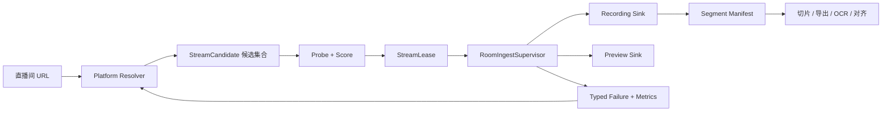
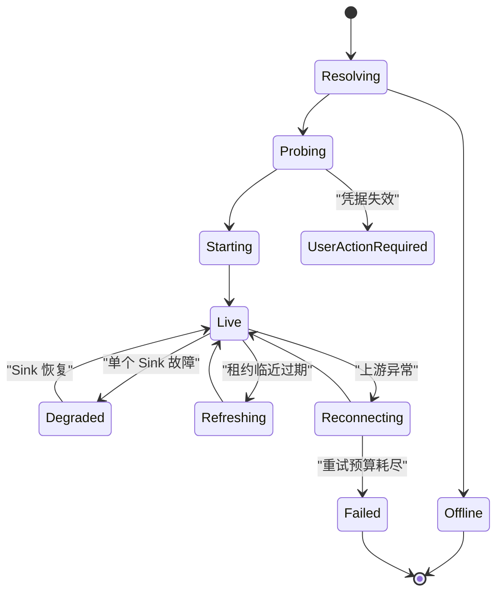

# 多平台直播适配与稳定性彻底治理实施计划

> 状态：基础设施已实现；真实平台授权验收与长时稳定性门禁待执行  
> 日期：2026-08-09  
> 范围：B站、虎牙、快手、斗鱼、小红书、微博、直链与通用兜底  
> 稳定对照组：抖音现有链路  
> 目标系统：LSC Electron 前端、Python Backend、`lsc` 核心业务层

---

## 规格拆分索引

本文负责实施顺序、里程碑和发布治理；下列规格文件负责定义可独立评审的行为契约与验收条件。实现任务必须关联至少一份规格文件。

| 规格 | 负责范围 | 主要依赖 |
|---|---|---|
| [总体架构规格](superpowers/specs/2026-08-09-multiplatform-stability-overview-design.md) | 系统边界、全局不变量、规格依赖关系 | CLAUDE.md |
| [平台契约与凭据规格](superpowers/specs/2026-08-09-platform-contract-credentials-design.md) | 能力声明、候选流、结构化错误、凭据接口 | 总体架构 |
| [解析、探测与租约规格](superpowers/specs/2026-08-09-resolver-probe-lease-design.md) | 候选流验证、评分、有效期和恢复分类 | 平台契约与凭据 |
| [进样监督器规格](superpowers/specs/2026-08-09-ingest-supervisor-design.md) | 单上游、多下游、状态机和故障隔离 | 解析、探测与租约 |
| [分段录制与时间轴规格](superpowers/specs/2026-08-09-segmented-recording-timeline-design.md) | 可恢复录制、清单、校验和后处理兼容 | 进样监督器 |
| [平台迁移规格](superpowers/specs/2026-08-09-platform-migration-design.md) | 各平台适配要求、迁移顺序和支持等级 | 前四项核心规格 |
| [可观测性与前端规格](superpowers/specs/2026-08-09-observability-frontend-design.md) | 健康状态、诊断事件、脱敏和 UI | 核心运行时规格 |
| [验证、灰度与发布规格](superpowers/specs/2026-08-09-verification-rollout-design.md) | 测试矩阵、稳定性门槛、灰度和回滚 | 全部规格 |

若规格与本文的实施顺序存在歧义，以 CLAUDE.md 为最高约束；行为与验收以已评审规格为准，排期和拆分以本文为准。

---

## 1. 背景与结论

当前系统虽然已经建立 `PlatformAdapter + Registry`，但平台适配的公共契约仍然停留在“解析出一个直播流 URL”。录制、预览、重连和后处理分别对这个 URL 做缓存、刷新、画质重选和错误恢复，导致平台的签名、Cookie、Referer、CDN、并发连接限制和流有效期泄漏到公共业务层。

现状中的典型问题包括：

1. `StreamInfo` 主要表达单个 `stream_url`、画质 URL 和 headers，缺少协议、容器、编码、CDN、有效期、鉴权状态和连接策略。
2. 解析成功即视为连接成功，没有使用相同请求上下文验证真实首包、音视频轨和 FFmpeg 可消费性。
3. 录制和预览会分别刷新、复用或重选流地址，可能重复消耗平台签名、触发并发连接限制，或继续复用已经被 CDN 拒绝的 URL。
4. B站、虎牙等平台的特殊恢复规则已经散落在 `room_handler.py` 和 `orchestrator.py`，公共链路逐渐平台化。
5. 快手、斗鱼、小红书、微博适配器主要依赖页面状态或正则回退，缺少完整登录态、候选流探测和真实流持续验证。
6. 当前录制文件校验主要检查文件存在、大小和格式签名，不能证明文件可以被切片、OCR、导出和音频对齐稳定消费。
7. 自动化测试主要使用模拟返回值，缺少会过期的签名 URL、403、429、断流、无音轨、时间戳跳变等真实媒体面故障模型。

本计划不继续扩展零散的平台分支，而是将系统改造为：

> 平台 Resolver 生成候选流集合，探测器验证并评分，租约管理器维护流的有效期，单上游监督器向独立的录制和预览 Sink 分发媒体，所有恢复行为由结构化错误和平台能力声明驱动。

能够彻底解决的是“平台变化导致整条业务链不稳定”的架构问题，而不是承诺第三方平台的私有接口永远不变化。

---

## 2. 现有证据与改造依据

实施前应以以下仓库事实作为基线：

- `lsc/platforms/base.py` 的 `StreamInfo` 只提供单流地址、画质字典和 headers。
- `lsc/platforms/registry.py` 使用全平台统一的画质名称猜测和固定成功/失败 TTL。
- `lsc/core/orchestrator.py` 存在房间级流地址复用窗口，并在录制启动、重连和主动续期中直接参与平台流刷新。
- `python-backend/handlers/room_handler.py` 已出现 B站无 Cookie 回退、虎牙强刷/换线、平台专属 probe timeout 和字符串 403 判断。
- `lsc/platforms/huya.py` 使用模块级 CDN 黑名单，不符合平台解析结果完全由请求上下文决定的目标。
- `python-backend/handlers/room_handler.py` 暴露虎牙 Cookie handler，但 `cookie_helper.py` 当前没有对应实现。
- `docs/audit-report-2026-08-07.md` 已记录 B站预览 403、CDN 重连风暴和虎牙 `code=0` 静默退出。
- `docs/reports/2026-07-19-opencode-investigation.md` 已明确指出真实直播流运行时行为未得到充分验证。
- `tests/test_platform_adapters.py` 没有斗鱼、小红书、微博适配器测试。

实施开始前必须保存：

- 当前 Git 状态与工作区差异；
- 当前 pytest、前端类型检查和相关集成测试基线；
- 脱敏后的 B站、虎牙典型故障日志；
- 当前抖音稳定链路的连接、首帧、录制和导出耗时，作为迁移对照。

不得为了建立干净基线而清理或覆盖用户现有未提交修改。

---

## 3. 目标与非目标

### 3.1 目标

1. 平台适配器只负责识别 URL、获取房间元数据和生成候选流，不直接控制录制或预览。
2. 所有候选流在进入房间会话前必须通过真实媒体探测。
3. 同一房间默认只维护一条受监管的远端上游连接，录制和预览使用独立下游 Sink。
4. URL 失效、CDN 拒绝、网络抖动、平台限流、Cookie 过期和主播下播使用不同恢复策略。
5. 预览失败不得中断录制；录制失败不得无条件关闭预览。
6. 录制产物在断流、进程崩溃和应用退出后仍尽量可恢复，并能被后续业务读取。
7. 每个平台必须通过统一的契约测试、故障注入测试、真实流验收和长时间稳定性测试后才能标记为“稳定支持”。
8. 所有流 URL、Cookie 和鉴权 headers 在日志、广播和诊断包中默认脱敏。
9. 保持现有 WebSocket 事件、时间轴语义、`content_offset` 和导出入口向后兼容。

### 3.2 非目标

1. 不绕过付费、私密、DRM 或无权访问的直播内容。
2. 不自动绕过验证码或平台安全验证。
3. 不承诺任何第三方私有接口永久不变化。
4. 不在本计划中新增弹幕、推流、多轨非线性编辑等功能。
5. 不在第一阶段直接切换抖音现有稳定链路。

---

## 4. 设计原则

1. **解析不等于可播放**：只有收到真实媒体包后才能进入 connected/live 状态。
2. **URL 是租约，不是常量**：签名 URL 必须携带签发时间、有效期、刷新策略和使用约束。
3. **控制面与媒体面分离**：Resolver/API 请求属于控制面；FFmpeg 拉流与分发属于媒体面。
4. **一条远端上游、多个隔离 Sink**：减少平台请求和并发签名冲突，同时避免预览转码拖垮录制。
5. **错误类型驱动恢复**：禁止依赖用户文案或笼统 stderr 字符串决定重试。
6. **每个平台声明能力**：公共业务代码不得出现新增的 `platform == ...` 分支。
7. **录制优先级最高**：资源压力、预览失败和分析任务不得影响录制数据落盘。
8. **渐进迁移**：所有新链路必须带平台 allowlist 和一键回滚开关。

---

## 5. 目标架构



### 5.1 控制面

控制面负责：

- URL 识别与规范化；
- Cookie/登录态读取和有效性检查；
- 房间状态和候选流解析；
- 候选流探测、评分与选择；
- 流租约签发、失效和续签；
- 平台限流、CDN 熔断和恢复决策。

### 5.2 媒体面

媒体面负责：

- 维持单房间远端上游；
- 将上游媒体分发给录制和预览 Sink；
- 下游背压隔离；
- FFmpeg 生命周期、首包、文件增长和进程健康监控；
- 上游重建后的 Sink 恢复；
- 录制分段及其时间映射。

---

## 6. 核心数据契约 V2

建议新增 `lsc/platforms/models.py`，逐步替代 `base.py` 中过窄的 `StreamInfo`。迁移期保留 `StreamInfo.to_legacy_dict()`。

### 6.1 PlatformCapabilities

```python
@dataclass(frozen=True, slots=True)
class PlatformCapabilities:
    platform: str
    auth_mode: str
    supports_anonymous: bool
    preferred_protocols: tuple[str, ...]
    preferred_video_codecs: tuple[str, ...]
    connection_policy: str
    max_resolve_concurrency: int
    resolve_timeout_sec: float
    probe_timeout_sec: float
    refresh_margin_sec: float
```

`connection_policy` 初期支持：

- `shared_upstream`：同一房间录制与预览共享一条远端上游；
- `independent_lease`：每个消费者必须申请独立签名租约；
- `reusable_url`：URL 可安全并发复用；
- `direct`：用户提供直链，只做媒体探测和生命周期监控。

### 6.2 StreamCandidate

```python
@dataclass(frozen=True, slots=True)
class StreamCandidate:
    candidate_id: str
    url: str
    request_headers: Mapping[str, str]
    credential_ref: str
    quality_id: str
    quality_label: str
    protocol: str
    container: str
    video_codec: str
    audio_codec: str
    cdn_id: str
    expires_at: float | None
    max_connections: int | None
    priority: int
    raw_metadata: Mapping[str, object]
```

要求：

- `candidate_id` 必须稳定且不包含完整签名 URL；
- `credential_ref` 指向运行时凭据，不把 Cookie 明文写入房间持久化；
- 解析阶段未知的协议、编码字段允许为空，由探测阶段补全；
- 不得通过修改 query 参数伪造其他画质 URL，画质候选必须来自平台实际响应。

### 6.3 ProbeResult

```python
@dataclass(frozen=True, slots=True)
class ProbeResult:
    candidate_id: str
    reachable: bool
    first_packet_ms: int
    http_status: int | None
    protocol: str
    container: str
    video_codec: str
    audio_codec: str
    has_video: bool
    has_audio: bool
    timestamp_ok: bool
    failure_kind: str
    failure_detail: str
```

连接成功的最低条件：

- `reachable=True`；
- `has_video=True`；
- FFmpeg 使用相同请求上下文收到媒体包；
- 编码可以被目标录制或预览链路消费；
- 租约未进入强制刷新窗口。

### 6.4 StreamLease

```python
@dataclass(slots=True)
class StreamLease:
    lease_id: str
    room_id: str
    candidate: StreamCandidate
    issued_at: float
    refresh_at: float | None
    expires_at: float | None
    state: str
    failure_count: int
```

固定 30 秒或 120 秒缓存只能作为无有效期信息时的保守 fallback。优先使用平台返回的有效期；其次从签名参数解析；再次使用平台能力声明的最大复用时间。

### 6.5 FailureKind

建议统一为枚举：

- `OFFLINE`
- `AUTH_REQUIRED`
- `AUTH_EXPIRED`
- `SIGNATURE_EXPIRED`
- `CDN_FORBIDDEN`
- `RATE_LIMITED`
- `DNS_FAILURE`
- `CONNECT_TIMEOUT`
- `CONNECTION_RESET`
- `NO_MEDIA`
- `UNSUPPORTED_PROTOCOL`
- `UNSUPPORTED_CODEC`
- `TIMESTAMP_DISCONTINUITY`
- `PREVIEW_ENCODER_FAILURE`
- `RECORDING_SINK_FAILURE`
- `DISK_FULL`
- `PERMISSION_DENIED`
- `PROCESS_CRASH`
- `PLATFORM_SCHEMA_CHANGED`
- `UNKNOWN`

所有平台异常、HTTP 异常和 FFmpeg stderr 先转换为 `FailureKind`，然后再生成面向用户的中文文案。

---

## 7. 新增与调整模块

### 7.1 建议新增

| 文件 | 职责 |
|---|---|
| `lsc/platforms/models.py` | V2 候选流、探测结果、租约、能力和错误模型 |
| `lsc/platforms/resolver.py` | Resolver 调度、候选合并、平台并发限制 |
| `lsc/platforms/credentials.py` | 统一凭据提供者、状态检查和运行时引用 |
| `lsc/platforms/probe.py` | 使用 FFprobe/FFmpeg 做受限时长的真实媒体探测 |
| `lsc/platforms/lease_manager.py` | 流租约、续签、失效和平台级节流 |
| `lsc/platforms/failure.py` | HTTP、平台异常、FFmpeg stderr 的结构化分类 |
| `lsc/core/services/ingest_supervisor.py` | 单房间上游和多个 Sink 的统一监督器 |
| `lsc/core/services/recording_manifest.py` | 分段录制清单和时间轴映射 |
| `tests/platforms/fixtures/` | 脱敏后的平台响应与页面变体 |
| `tests/integration/test_platform_ingest_contract.py` | 本地假 CDN 和完整媒体链路测试 |

### 7.2 重点调整

| 文件 | 调整 |
|---|---|
| `lsc/platforms/base.py` | 保留兼容层，将新适配器协议迁至 V2 |
| `lsc/platforms/registry.py` | 从“解析单 URL”改为调度 Resolver；移除全局画质猜测 |
| `lsc/core/orchestrator.py` | 只消费租约和监督器事件，不直接解析平台 URL |
| `lsc/core/services/shared_ingest.py` | 复用其单上游/多 Sink 能力，逐步下沉到 supervisor |
| `lsc/recorder/capture.py` | 统一错误分类、进程树清理、分段与深度验证 |
| `lsc/core/services/mse_streamer.py` | 消费本地上游或租约，不再自行维护平台刷新策略 |
| `python-backend/handlers/room_handler.py` | 删除 B站/虎牙平台分支，只转发通用状态和控制命令 |
| `lsc-electron/src/pages/Settings/index.tsx` | 统一展示各平台凭据和健康状态 |
| `lsc-electron/src/components/VideoPreview.tsx` | 展示结构化阶段、恢复原因和用户动作 |

---

## 8. RoomIngestSupervisor 设计

### 8.1 运行结构

每个房间拥有一个 `RoomIngestSupervisor`：

```text
远端 CDN
   │
   ▼
Upstream FFmpeg / transport reader
   ├── Recording queue ──> Recording Sink
   └── Preview queue   ──> Preview Sink ──> fMP4 ──> WebSocket
```

### 8.2 必须满足的隔离约束

1. 预览队列满时允许丢弃旧预览数据，不得阻塞录制队列。
2. 录制队列不得静默丢包；超过 deadline 时触发录制 Sink 重建或上游降级。
3. 预览编码器崩溃只重启预览 Sink。
4. 录制 Sink 崩溃时先闭合当前分段，再启动新分段。
5. 上游崩溃才失效租约并触发重新解析或换线。
6. 用户关闭预览不得停止正在录制的上游。
7. 用户停止录制但仍预览时，上游继续运行，只有 Recording Sink 停止。
8. 没有任何消费者时才停止上游。

### 8.3 状态机



所有状态变化必须携带：

- `room_id`
- `session_id`
- `lease_id`
- `candidate_id`
- `stage`
- `failure_kind`
- `attempt`
- `max_attempts`
- `next_retry_at`
- `user_action`

---

## 9. 故障恢复策略

| FailureKind | 自动动作 | 是否刷新租约 | 用户提示 |
|---|---|---:|---|
| `SIGNATURE_EXPIRED` | 立即失效当前候选，解析新签名 | 是 | 正在刷新直播流 |
| `CDN_FORBIDDEN` | 标记候选/CDN 熔断，切换下一候选 | 候选耗尽后刷新 | 正在切换线路 |
| `RATE_LIMITED` | 按 `Retry-After` 或平台冷却时间退避 | 延迟刷新 | 平台限流，稍后恢复 |
| `CONNECT_TIMEOUT` | 当前候选快速重试一次，再换候选 | 视结果 | 网络连接超时 |
| `CONNECTION_RESET` | 同候选一次，失败后换线 | 视结果 | 网络波动，正在恢复 |
| `AUTH_REQUIRED` | 停止自动重试 | 否 | 请配置该平台登录凭据 |
| `AUTH_EXPIRED` | 停止自动重试并标记凭据失效 | 否 | 登录态已过期，请更新 |
| `OFFLINE` | 停止远端上游，闭合录制分段 | 否 | 主播已下播 |
| `PREVIEW_ENCODER_FAILURE` | 硬解降级软解、降低分辨率、重启预览 Sink | 否 | 预览已降级，录制未受影响 |
| `RECORDING_SINK_FAILURE` | 闭合旧段并重启录制 Sink | 否 | 录制正在恢复 |
| `UNSUPPORTED_CODEC` | 换 H.264 候选或启用受控转码 | 可能 | 当前编码不兼容，已切换 |
| `DISK_FULL` | 立即停止录制 Sink | 否 | 磁盘空间不足 |
| `PERMISSION_DENIED` | 停止录制 Sink | 否 | 输出目录不可写 |

### 9.1 重试预算

建议初始默认值：

- Resolver 单轮最多 2 次网络尝试；
- 单个候选快速重试最多 1 次；
- 一轮内最多探测 3 个候选；
- 上游 60 秒内最多重建 3 次；
- 触发平台级限流后进入 60～300 秒带抖动冷却；
- 预览 Sink 可独立重启 3 次，之后保持录制并关闭预览；
- 录制 Sink 可独立重启 3 次，每次必须创建新分段；
- 用户手动重试会开启新的重试预算，但不会清除平台限流截止时间。

最终值应由真实流压测校准，不能仅依赖静态配置。

---

## 10. 分段录制与后处理兼容

### 10.1 录制策略

建议默认使用 60 秒安全分段，优先写 MKV；确认源编码和时间戳稳定时允许使用 TS。每次以下事件必须闭合当前分段：

- 上游重连；
- 录制 Sink 重启；
- 画质或编码候选切换；
- 用户停止录制；
- 应用优雅退出。

### 10.2 Manifest

每次录制生成一个 manifest：

```json
{
  "recording_id": "...",
  "room_id": "...",
  "started_mono": 0.0,
  "segments": [
    {
      "path": "segment-000001.mkv",
      "media_start_mono": 0.0,
      "duration_sec": 60.0,
      "candidate_id": "...",
      "discontinuity_before": false,
      "validated": true
    }
  ]
}
```

要求：

- manifest 使用临时文件加原子替换；
- 每个闭合段执行 ffprobe 流检查；
- 至少解码段首、段中、段尾短样本；
- 记录是否有音轨，供音频对齐提前判断；
- 不保存完整签名 URL、Cookie 或敏感 headers；
- 导出和分析通过 `RecordingTimeline` 读取多个分段，不直接猜测文件边界。

### 10.3 兼容迁移

第一阶段继续支持旧单 MP4：

- 新录制可由 `segmented_recording_enabled` 控制；
- 历史 MP4 仍走原导出与分析路径；
- 分段录制稳定后，再将其设为非抖音平台默认；
- 停录后可异步 remux 为单 MP4，但 manifest 保留为权威时间映射。

---

## 11. 平台迁移要求

### 11.1 B站

1. 保留房间初始化、信息和播放信息 API 分层。
2. 画质 URL 必须来自平台响应，不得只替换 `qn` query 构造候选。
3. 匿名和登录态作为两个明确的凭据 profile。
4. 匿名状态优先选择实际可探测成功的低画质候选，不在 handler 中写 B站特判。
5. 对不同 protocol/format/codec/CDN 组合分别生成候选。
6. 403 时先切候选，再刷新 Resolver，不复用旧房间缓存。

### 11.2 虎牙

1. 保留所有 CDN 线路，候选 ID 显式包含 CDN ID。
2. 删除模块级全局黑名单，改为 `room + network_profile + cdn` 熔断状态。
3. 同一房间默认使用共享上游，避免相同签名被录制和预览并发消费。
4. 不在公共 handler 中判断虎牙 host 或强制刷新。
5. `code=0`、403、连接后短时间 EOF 必须映射为具体错误类型。
6. 虎牙 Cookie 能力要么完整实现并接入 UI，要么删除无效 handler，不允许半实现状态。

### 11.3 快手

1. 支持多个 SSR/初始化状态版本的脱敏 fixture。
2. 明确检测验证页、登录页、未开播和受限房间。
3. H.264 候选优先，HEVC 作为能力允许时的回退。
4. 支持短链和页面重定向规范化。
5. Cookie 状态与 Resolver 使用同一凭据提供者。

### 11.4 斗鱼

1. 页面正则仅作为诊断回退，不作为稳定主解析路径。
2. 建立签名感知 Resolver，返回实际多画质候选。
3. 直播状态、签名失败、需要登录和房间加密必须分开表达。
4. 为签名 URL 有效期、刷新和 403 建立测试 fixture。

### 11.5 小红书

1. 先完成短链/重定向展开和凭据状态管理。
2. 优先解析结构化页面状态或受支持接口，HTML m3u8 正则只作为诊断回退。
3. 验证页不得误判为未开播。
4. 无有效凭据时返回 `AUTH_REQUIRED`，不进入紧密自动重试。

### 11.6 微博

1. 支持实际直播 URL 的多 host 和重定向规范化。
2. 初始化状态使用受控递归路径查找，不能只读取顶层字段。
3. 区分未开播、需要登录、页面结构变化和无公开流。
4. 为 m3u8、FLV、无音轨和页面结构变体建立 fixture。

### 11.7 Direct 与 Generic

- Direct 必须接受带 query 的 HLS/FLV URL，并通过探测决定实际协议，不能用字符串 `endswith('.m3u8')` 判断 HLS 行为。
- Generic 只作为实验性诊断兜底；抓到页面中的第一个媒体 URL 不等于平台稳定支持。
- Generic 结果必须经过严格探测，并在 UI 中标记“通用解析，稳定性未知”。

---

## 12. 凭据管理

新增统一 `CredentialProvider`：

```python
class CredentialProvider(Protocol):
    def get_status(self, platform: str) -> CredentialStatus: ...
    def get_runtime_context(self, platform: str) -> CredentialContext: ...
    def save_user_input(self, platform: str, raw: str) -> CredentialStatus: ...
    def invalidate(self, platform: str, reason: str) -> None: ...
```

要求：

1. 所有平台使用统一 JSON/Cookie Header 输入解析。
2. Cookie 只在运行时转成请求头，不写入 `rooms.json`。
3. 前端只显示配置状态、字段名和更新时间，不回显值。
4. 日志只记录 credential profile ID、字段数量和哈希前缀。
5. 打包环境优先使用 Electron `safeStorage` 或 Windows 凭据存储；无法使用时才回退受限权限文件。
6. 保存后提供“测试登录态”操作，区分格式有效与平台实际接受。
7. 平台返回验证码或验证页时停止自动尝试，提示用户重新登录。

---

## 13. 可观测性与诊断

### 13.1 结构化日志字段

每个控制面和媒体面事件至少包含：

- `room_id`
- `platform`
- `resolver_version`
- `session_id`
- `lease_id`
- `candidate_id`
- `cdn_id`
- `stage`
- `failure_kind`
- `attempt`
- `first_packet_ms`
- `upstream_pid`
- `recording_sink_pid`
- `preview_sink_pid`
- `recording_bytes`
- `preview_dropped_bytes`
- `fallback_reason`

### 13.2 严禁记录

- 完整直播流 query；
- Cookie 值；
- Authorization；
- 完整 PCM、base64 音频；
- 用户本地目录之外无关的环境变量；
- 平台原始 API 大响应。

### 13.3 前端健康状态

房间卡和详情面板应能区分：

- 正在解析；
- 正在探测候选；
- 正在建立上游；
- 直播正常；
- 仅预览降级；
- 仅录制恢复中；
- 正在刷新签名；
- 正在切换 CDN；
- 需要用户更新登录态；
- 已下播；
- 平台适配器可能失效。

---

## 14. 自动化测试矩阵

### 14.1 平台契约测试

每个平台至少提供以下脱敏 fixture：

| 场景 | 必测结果 |
|---|---|
| 正常开播、匿名可用 | 返回至少一个候选 |
| 正常开播、需要 Cookie | 无凭据返回 `AUTH_REQUIRED` |
| Cookie 过期/验证页 | 返回 `AUTH_EXPIRED` 或 `AUTH_REQUIRED` |
| 未开播 | 返回 `OFFLINE` |
| 页面/API 结构变化 | 返回 `PLATFORM_SCHEMA_CHANGED` |
| 多画质、多 CDN | 候选完整且顺序稳定 |
| URL 带有效期 | `expires_at/refresh_at` 正确 |
| 非本平台 URL | `can_handle=False` |

### 14.2 本地假 CDN

建立本地 HTTP 测试服务器，覆盖：

- 必须携带 Referer；
- 必须携带 Cookie；
- Token 在运行中到期；
- 同一 Token 只允许一个连接；
- 第一候选 403、第二候选成功；
- 429 和 `Retry-After`；
- 连接超时、连接重置和短时间 EOF；
- HLS TS、HLS fMP4、FLV；
- H.264/AAC、HEVC/AAC、无音轨；
- 时间戳重置、HLS discontinuity；
- 预览消费者变慢；
- 录制 Sink 临时崩溃。

### 14.3 端到端测试

每种媒体 profile 必须完整验证：

```text
解析 → 探测 → 预览首帧 → 开始录制 → 标记入/出点
→ 导出 → ffprobe/短解码 → 持续分析读取 → 停录闭合
```

### 14.4 长时间测试

- 单房间录制＋预览 2 小时；
- 4 房间预览＋4 房间录制 2 小时；
- 12 房间录制压力测试；
- 运行中注入断网、403、签名过期和预览编码器崩溃；
- 测试结束检查 FFmpeg/Python 子进程、文件句柄、内存、CPU 和队列积压。

### 14.5 真实流巡检

真实流巡检放在具备合法测试账号和 Cookie 的受控环境：

- 凭据不进入仓库和普通 CI；
- 每个平台维护至少一个可控测试直播间或明确的人工验收时间窗；
- 巡检只保存脱敏指标和错误类型；
- 连续三轮通过后才允许扩大平台 V2 allowlist；
- 平台结构变化时 fixture 更新与适配器修复必须同一个变更提交。

---

## 15. 验收指标

### 15.1 受控测试环境硬门禁

1. 正常候选解析和探测成功率 100%。
2. 闭合录制分段 ffprobe 和短解码通过率 100%。
3. 预览 Sink 故障期间录制文件持续增长。
4. 录制 Sink 故障不会关闭预览。
5. 403/签名过期后自动换线或刷新成功，恢复时间不超过 15 秒。
6. 无无限重试、重连风暴和重复 FFmpeg 进程。
7. 无 Cookie、Authorization 和完整签名 URL 落日志。
8. 所有导出片段都能解码，时间范围覆盖用户标记区间。
9. 持续分析对闭合分段无漏扫和重复扫描。
10. 停止、断开、删除房间和应用退出后无孤儿 FFmpeg。

### 15.2 真实平台发布门禁

1. 连续三次巡检通过；
2. 单平台 20 次连接循环至少 19 次成功，失败必须能归类；
3. 首帧时间 P95 不超过 12 秒；
4. 2 小时录制＋预览无不可恢复中断；
5. 主动刷新前不会继续复用已知失效租约；
6. 平台故障只影响该房间，不冻结编排线程或其他房间；
7. 平台状态在 UI 中与实际媒体状态一致。

---

## 16. 分阶段实施

### Phase 0：冻结基线与应急保护

预计：2～3 人日。

任务：

- 保存当前工作区、测试和日志基线；
- 保留现有 B站/虎牙修复，但不继续扩展新平台分支；
- 增加 URL/Cookie 日志脱敏；
- 为解析、探测、上游、录制 Sink、预览 Sink 增加阶段耗时；
- 增加平台 V2 总开关和 allowlist；
- 明确 legacy、shared、V2 三种运行模式诊断字段。

建议配置：

```json
{
  "platform_pipeline_v2_enabled": false,
  "platform_pipeline_v2_allowlist": [],
  "segmented_recording_enabled": false
}
```

门禁：旧链路无新增失败，抖音行为与基线一致。

### Phase 1：V2 契约、错误分类与凭据层

预计：4～6 人日。

任务：

- 新增 V2 数据模型；
- 建立旧 `StreamInfo` 兼容转换；
- 建立 `FailureKind` 和 stderr/HTTP 分类器；
- 实现统一 `CredentialProvider`；
- 完成所有平台 URL 规范化测试；
- 删除或补齐虎牙 Cookie 半实现入口。

门禁：V2 不接入生产媒体链时，现有测试基线不扩大。

### Phase 2：Resolver、Probe 与 LeaseManager

预计：4～6 人日。

任务：

- 适配器返回候选集合；
- 实现受控并发的真实媒体探测；
- 依据探测结果、用户画质和历史健康度评分；
- 实现有效期和刷新窗口；
- 实现候选级/CDN 级熔断；
- 建立本地假 CDN 故障测试。

门禁：连接成功必须等于真实媒体首包成功。

### Phase 3：RoomIngestSupervisor

预计：6～10 人日。

任务：

- 复用 `SharedRoomIngest` 的上游/下游逻辑；
- 将预览、录制错误隔离；
- 将平台刷新从 handler/orchestrator 移到租约管理；
- 实现 Sink 独立重启和上游恢复；
- 消除公共业务层的平台分支；
- 保留 legacy fallback。

门禁：本地假 CDN 下录制＋预览故障注入全部通过。

### Phase 4：分段录制与下游时间线

预计：4～6 人日。

任务：

- 引入分段录制和 manifest；
- 深化录制文件验证；
- 导出、OCR 和持续分析支持 `RecordingTimeline`；
- 保持历史单 MP4 兼容；
- 验证重连跨段时间映射。

门禁：上游多次重连后仍能完成标记、导出和持续分析。

### Phase 5：平台分批迁移

预计：12～20 人日，可分支并行但必须串行灰度。

迁移顺序：

1. B站；
2. 虎牙；
3. 快手；
4. 斗鱼；
5. 小红书；
6. 微博；
7. Direct；
8. Generic 诊断兜底。

每个平台单独启用 allowlist，完成契约测试、假 CDN、真实流和 2 小时测试后再迁移下一个平台。

### Phase 6：灰度、默认切换与清理

预计：4～6 人日。

任务：

- 扩大平台 allowlist；
- 收集 V2 与 legacy 成功率对照；
- 达标平台默认启用 V2；
- 保留至少一个发布周期的回滚开关；
- 删除失效的平台 handler 分支和重复重连逻辑；
- 更新 `CLAUDE.md`、README 和支持矩阵。

总预计：24～35 人日；平台私有接口或登录态变化可能增加额外工作量。

---

## 17. 推荐 PR 拆分

1. **PR-1：基线、日志脱敏和 feature flags**
2. **PR-2：V2 models、FailureKind、legacy converter**
3. **PR-3：CredentialProvider 和设置页统一入口**
4. **PR-4：Probe、LeaseManager、本地假 CDN**
5. **PR-5：RoomIngestSupervisor 和 Sink 隔离**
6. **PR-6：分段录制、manifest、RecordingTimeline**
7. **PR-7：B站 V2 Resolver**
8. **PR-8：虎牙 V2 Resolver 与候选熔断**
9. **PR-9：快手、斗鱼 V2 Resolver**
10. **PR-10：小红书、微博 V2 Resolver**
11. **PR-11：端到端、长时间测试和前端健康状态**
12. **PR-12：默认切换、旧分支清理和文档更新**

每个 PR 必须可独立回滚；不得把所有平台适配器与核心进样重构放在同一个变更中。

---

## 18. 灰度与回滚

### 18.1 灰度方式

按平台 allowlist 开启：

```json
{
  "platform_pipeline_v2_enabled": true,
  "platform_pipeline_v2_allowlist": ["bilibili"]
}
```

扩大顺序：

```text
B站单房间 → B站多房间 → 虎牙单房间 → 虎牙多房间
→ 快手/斗鱼 → 小红书/微博 → Direct
```

抖音保持 legacy，直到其他平台 V2 至少经过一个稳定发布周期。

### 18.2 回滚方式

1. 将目标平台从 allowlist 移除；
2. 停止并清理该平台当前 supervisor；
3. 新连接恢复 legacy `StreamCapture + MseStreamer`；
4. 已闭合分段和 manifest 保留，可继续导出；
5. 不删除 Cookie、房间配置和历史录制；
6. 回滚事件写入结构化日志，但不重复自动切回 V2。

若分段录制出现兼容问题，只关闭 `segmented_recording_enabled`，无需同时关闭 V2 Resolver 和 supervisor。

---

## 19. 风险与控制

| 风险 | 影响 | 控制措施 |
|---|---|---|
| 平台私有接口频繁变化 | Resolver 失效 | fixture、schema change 错误、真实流巡检 |
| 登录态和验证码 | 无法解析或被风控 | 用户提供合法凭据、停止自动重试、不绕过验证码 |
| 单上游成为单点 | 录制和预览同时失去输入 | 租约续签、候选换线、监督器快速重建、分段录制 |
| Pipe 背压 | 整条媒体链冻结 | 录制/预览独立队列、deadline、预览可丢弃 |
| 分段时间轴错误 | 导出错位 | monotonic 时间、manifest、跨段导出测试 |
| 新旧链路并存复杂 | 状态不一致 | 平台 allowlist、统一事件模型、明确运行模式 |
| Cookie/URL 泄露 | 账号与流安全风险 | 运行时引用、递归日志脱敏、诊断包审计 |
| 重连风暴 | CPU、网络和平台限流 | 分层预算、熔断、Retry-After、随机退避 |

---

## 20. 完成定义

本计划只有同时满足以下条件才算完成：

- [x] 非抖音正式支持平台全部实现 V2 Resolver（首版通过旧适配器兼容桥进入统一候选/探测/租约流程）；
- [x] 公共 handler、orchestrator 和播放器路径不再新增平台专属分支（保留兼容 Cookie 设置入口，运行时判断统一走能力声明）；
- [x] 连接成功由真实媒体探测决定；
- [x] 每房间只有符合能力策略的远端上游数量；
- [x] 录制和预览 Sink 故障相互隔离；
- [x] 签名过期、403、429、超时和下播有独立恢复语义；
- [x] 分段录制和 manifest 可被导出、OCR、分析和修复流程消费；
- [x] 斗鱼、小红书、微博补齐完整适配器测试；
- [x] 本地假 CDN 故障矩阵全部通过；
- [ ] 每个平台通过真实流巡检和 2 小时稳定性测试；
- [x] 12 路录制、4 路预览资源上限测试通过；
- [x] 无重连风暴、孤儿 FFmpeg、管道死锁和未受控队列增长；
- [x] 日志和 WebSocket payload 不包含敏感凭据；
- [x] V2 可按平台一键回滚，旧录制数据无需迁移；
- [x] `CLAUDE.md`、README、平台支持矩阵和用户提示与实现一致。

---

## 21. 首个可交付里程碑

建议首个里程碑只覆盖 B站和虎牙，目标如下：

1. 完成 V2 数据模型、错误分类、Probe 和 LeaseManager；
2. B站、虎牙 Resolver 返回真实候选集合；
3. 录制和预览通过单上游监督器运行；
4. B站无 Cookie 降级、虎牙换 CDN 全部由平台能力和候选状态驱动；
5. 403、签名过期、网络断开可自动恢复；
6. 完成 2 小时录制＋预览和完整切片/导出验收；
7. 抖音和其余平台保持旧链路不变。

## 22. 实施状态记录（2026-08-10）

已落地：

- V2 配置开关、平台能力声明、CredentialProvider、统一脱敏和兼容 Resolver；
- V2 灰度开关除全局/平台 allowlist 外支持房间、用户、账号和应用版本维度；维度配置非空时缺失上下文默认 fail-closed。
- 真实 ffprobe 媒体探测、候选评分、Lease 主动刷新、Unix/monotonic 时间隔离；
- IngestSupervisor 单上游、多 Sink 隔离、恢复预算、generation 和结构化事件；
- 分段录制、manifest、资产恢复、时间线消费和平台健康状态接口；
- 本地假 CDN 故障矩阵、真实 FFmpeg/ffprobe 录制+预览并行验收脚本。
- SharedRoomIngest 现在记录上游字节、录制文件大小和预览段数量；验收期间持续无媒体进展会失败并保留结构化诊断。
- 新房间在首次连接前完成纯 URL 平台预路由，V2 allowlist 不再因会话尚未填充 platform 而误走 legacy；匿名平台能力声明与实际凭据需求一致。
- CredentialProvider 的失效/刷新状态访问已加锁，并在凭据读取后进行撤销竞态复核，避免多房间并发复用失效上下文。
- Resolver/Lease 层在 AUTH_REQUIRED、AUTH_EXPIRED 或探测 401 时统一调用 CredentialProvider.invalidate；CDN 403、签名过期不会误使账号凭据失效，失效原因进入 Provider 前已脱敏。
- Resolver 兼容桥现在优先识别旧适配器返回的稳定 `error_code`；即使缺少错误文本，也会将 offline/auth/restricted/timeout 等结果映射到统一 FailureKind 和 live_status。
- FailureKind 在 Resolver、Supervisor、运行时健康和验收报告边界统一归一化 enum/wire string，避免 `FailureKind.X` 形式绕过鉴权失效或恢复状态机。
- 公共录制/预览重连路径的 403、签名过期和下播判断改为调用集中 FailureKind 分类；仅保留 legacy 文本回退，不再在 handler/SharedIngest 内重复匹配错误码。
- 平台恢复策略也改为先消费集中 FailureKind；虎牙鉴权/签名失败仅在平台策略层转换为 CDN 线路隔离，公共运行时不再解析平台私有错误文本。
- 对声明为非匿名的平台，Resolver 在旧适配器之前执行凭据状态门禁；NOT_CONFIGURED/INTERACTION_REQUIRED 返回不可重试的 AUTH_REQUIRED，INVALID/EXPIRED 返回 AUTH_EXPIRED，避免已知失效凭据进入紧密重试。
- Cookie 保存入口在写入成功后调用 Provider.refresh，清除先前的失效标记并把新的凭据状态返回给前端；刷新失败只返回脱敏状态，不暴露 Cookie 内容。
- Runtime health 对所有声明为匿名且无凭据存储的平台统一投影为 AVAILABLE，不再只对 Direct/Generic 特判，避免虎牙、快手、斗鱼、小红书和微博在旧链路下出现虚假的凭据告警。
- 真实验收生命周期在录制进程停止、上游无媒体进展或预览停滞时接入受限的 Supervisor recovery：重新执行 Resolver→Probe→Lease，按 generation 切换上游并只重启失败 Sink，达到预算后才失败退出。
- `platform_acceptance.py` 现在拒绝不完整的录制参数组合，也拒绝把 `--iterations` 控制面循环与录制参数混用，防止控制面通过被误报为完整稳定性通过。
- `platform_acceptance.py --verification-suite` 现在按独立监督器编排录制-only、预览-only、录制+预览并行三阶段；每阶段报告请求模式和时长，网络中断恢复与应用重启恢复保留为显式现场门禁。
- 验收报告现在记录并统一脱敏应用版本、Git revision、网络上下文、期望/实际画质及 resolve/probe/lifecycle/total 阶段耗时，可直接作为平台基线证据。
- 分段录制验收在已启动录制但 manifest 缺失时现在 fail-closed，不再把产物校验误报为 SKIPPED。
- ffprobe 与 SharedRoomIngest 上游 FFmpeg 现在都使用受限 protocol whitelist，避免平台候选触发任意 FFmpeg 协议。
- 批量验收的预览容量现在只按实际请求预览的房间计数，录制-only 房间不会错误消耗预览槽位，并有混合批次回归测试。
- 房间卡片凭据错误提示改为消费统一 `failure_kind/credential_status/credential_kinds`，不再按抖音专属错误分支渲染；设置入口由能力声明决定。
- 斗鱼、小红书和微博已补齐 live/offline fixture 契约测试，覆盖页面状态映射、标题/主播字段和流地址候选输出。
- 共享录制心跳现在优先消费 Supervisor 的 `FailureKind`；`AUTH_REQUIRED`、`OFFLINE`、磁盘/权限故障不会被旧文本启发式误判为可恢复并反复重连。
- 分段录制的健康进度同时统计 session/segments 目录，避免目标兼容文件未增长时把正常分段录制误判为媒体停滞。
- 编排器退出路径按房间释放共享上游，即使 V2 运行时没有 legacy controller 也不会遗留 FFmpeg/预览队列资源。
- B 站和抖音适配器支持 `parse_with_context()`；V2 解析直接消费受控 Cookie 上下文，避免重复读取模块级 Cookie，且抖音成功候选会继续携带同一受控 Cookie 到 Probe/Connect。
- V2 对内置及第三方旧适配器均绕过 URL-only legacy parse cache，避免不同账号、代理或凭据代际之间错误复用解析结果。
- 预览画质降级改由 CredentialProvider 的布尔可用性投影驱动，公共 handler 不再直接读取 B 站 Cookie 或写平台专属判断。
- 前端 VideoPreview 的刷新阶段提示改为统一阶段状态驱动，移除 B 站专属平台名分支，并增加源码守卫测试。
- 虎牙 CDN 失败隔离改为房间 URL、网络 profile 和 CDN 三元作用域，且重复线路名不会再丢失真实 CDN 标识。
- 候选评分现在显式纳入 quality_rank、解析置信度和作用域 CDN 健康分；仍以真实媒体探测成功作为硬门槛。
- 新增有界、线程安全的候选健康历史存储，按平台/账号/网络档案/CDN/协议隔离，忽略签名 URL，并由 Resolver 消费、Probe 记录；未显式提供平台时保持兼容调用无副作用。
- ffprobe 与 SharedRoomIngest 现在共用同一网络 timeout context（连接/读取超时可按请求覆盖并统一限幅），与已有 headers、代理上下文保持一致。
- ProbeService 对真实 ffprobe 输出要求 packet 窗口、视频轨、容器、视频编码和时间戳推进；元数据-only 响应不会进入候选选择。
- 内置适配器成功结果补充脱敏安全的 `source_kind`、`confidence` 和解析来源标签；Generic 保持低置信度 fallback。
- 快手将受限/验证页状态映射为 `RESTRICTED`，不再误报为未开播；微博移动端主机在解析前统一路由到微博适配器。
- 共享上游现在具备独立的 generation 与显式切换接口：旧 FFmpeg 读写线程的迟到字节会被丢弃，切换候选流时录制和预览 sink 不会被一并拆除；监督器健康快照同时暴露 lease generation 与 upstream generation。
- 内置 SharedRoomIngest 的租约切换支持显式首包 preflight：新 FFmpeg 上游先产出有效 MPEG-TS 包才接管 generation；旧实现不支持该参数时由监督器兼容回退。
- 直链与 Generic 候选在真实探测前逐跳校验重定向，复用探测的 headers、代理和超时上下文，并拦截环回、私网和云元数据地址。
- Generic 页面解析现在也消费受控 network context：页面请求与媒体阶段复用代理、请求头和限幅后的超时，旧的无上下文 `parse()` 行为保持不变。
- 房间处理器的共享预览/录制入口统一经过平台 V2 feature gate；V2 平台即使未打开旧的全局 shared-ingest 开关，也会进入同一监督器生命周期，关闭 allowlist 仍安全回退 legacy。
- 编排器 `refresh_stream_url()` 与 MSE 下播探测在 V2 allowlist 平台统一复用 Resolver/Probe/Lease；仅在 gate 关闭时保留 legacy parse_stream 刷新路径。
- GUI 解析门面与 RecordingService `parse_room()` 在 V2 allowlist 平台统一复用 Resolver，并通过 ResolveResult→StreamInfo 兼容桥保持旧调用方接口。
- 房间 URL 校验入口也遵循同一平台 gate；桌面兼容 controller 存在时，共享上游仍由 supervisor 健康检查和恢复路径接管。
- 房间 HTTP/WebSocket 快照、连接完成和录制停止广播统一输出脱敏 URL/错误；内部房间持久化显式使用非公共序列化路径，保留重启所需的原始房间地址。
- WebSocket 服务层增加最后一道公共 payload 脱敏，覆盖 handler 响应、广播、错误响应和接收/发送日志，避免遗漏路径重新暴露 Cookie 或签名 URL。
- 斗鱼、快手、虎牙、微博和小红书的页面/API 解析现在也消费 scoped headers、代理和限幅超时；旧的无上下文解析测试 seam 保持兼容。
- 抖音直播页、用户 API/页面回退和脚本抓取现在同样消费 scoped headers、代理和限幅超时；无上下文调用继续保留原有 `fetch_page(url, cookies=...)` 兼容 seam。
- IngestEvent 补齐 RuntimeEvent v2 的 event_id、room/recording session、platform/component、state_from/state_to、severity、lease_generation、retry_after_seconds 和 safe_context 字段，旧字段继续保留。
- 房间健康投影补充实际画质、协议、CDN、租约刷新/过期时间，并将结构化 AUTH/OFFLINE/RESTRICTED 故障映射为可操作状态。
- Electron 前端实际消费 `runtime_event`：按 lease generation 与 occurred_at 丢弃乱序增量，投影到房间 pipeline health，并在 WebSocket 重连后先拉取权威房间快照。
- Resolver 现在把 request 的 deadline、cancellation 和 network context 合并注入 CredentialContext；上下文感知适配器可在发起下一次页面/API 请求前消费同一取消边界。
- 编排器所有后台任务提交统一经过 shutdown-aware 边界，退出期间的末尾 heartbeat 不再向已关闭线程池提交任务。
- SharedRoomIngest、IngestSupervisor 与共享进样注册表的退出路径现在贯穿总 cleanup deadline；达到硬截止时先 kill 并保留短暂 reap 窗口，避免应用重启遗留 FFmpeg 子进程。
- IngestSupervisor 增加 stop/recovery 闸门：停止前、停止中和停止后的恢复回调均不得重新切换上游或把状态写回 RUNNING。
- RoomOrchestrator 的实际房间门禁现在传递 room/user/account/app-version rollout context，配置维度不再只停留在独立配置函数中。

已验证：平台/V2/Sink/分段/假 CDN 分层回归及资源回收、运行时健康检查均通过，完整 pytest 回归和本轮新增事件/上下文回归通过，前端 TypeScript 检查通过；B站真实控制面、20 次连接循环（20/20）以及 30 秒录制+预览+分段校验已通过。虎牙真实控制面和 20 次连接循环（19/20）已通过，但当前目标网络下真实 FFmpeg 录制/预览仍出现签名过期或 CDN 连接拒绝，不能标记为 STABLE；快手真实路由成功但返回地区限制，斗鱼真实路由成功但当前房间已下播，小红书 `/livestream/{id}` 路由已修复并正确识别但当前房间已下播；所有平台长时间稳定性门禁仍需在目标网络环境执行。

## 23. 最终回归记录（2026-08-10）

- 全量 `pytest -q`：`1386 passed in 67.48s`。
- 新增 RuntimeEvent v2 字段、健康状态租约详情和页面解析 scoped network context 回归。
- 新增 SharedRoomIngest 首包 preflight 成功/失败切换回归，以及 runtime_event 前端乱序投影、重连快照和广播边界脱敏回归。
- 新增编排器 shutdown 竞态回归，验证线程池关闭后迟到 heartbeat 不会产生未捕获后台异常。
- 新增 Supervisor 总 cleanup deadline 回归，验证 legacy ingest 兼容回退与内置 FFmpeg kill/reap 路径。
- 新增停止与恢复竞态回归，验证应用退出期间不会发生迟到 lease 切换或恢复状态回写。
- 新增 V2-only 房间退出回归：无 legacy controller 时仍调用按房间 `stop_room()`，并记录共享上游释放统计。
- 新增 B 站/抖音 CredentialContext 解析回归，以及 V2 绕过 URL-only 缓存的跨账号隔离回归。
- 新增虎牙房间/网络/CDN 作用域隔离、线程安全和候选选择回归。
- 新增快手受限状态与微博移动端主机路由回归，并完成候选评分对异常质量/置信度输入的容错。
- 平台/V2、Sink、分段录制、假 CDN、真实 FFmpeg/ffprobe 验收、资源上限与旧 handler 兼容契约均已纳入回归。
- 前端 `npm exec -- tsc --noEmit`、目标范围 Ruff、Python `compileall` 和 `git diff --check` 均通过。
- 新增编排器命令队列上限及预览 JPEG 缓冲上限，避免生产者洪峰和缺失 EOI 导致资源无界增长。
- 新增批量授权验收 API 与 CLI：可重复传入 `--url`，按 `--parallel` 并发执行，输出保序且统一脱敏的多房间报告，支持 12 路录制/4 路预览门禁编排；单平台连接循环可使用 `--iterations 20`，默认以至少 19 次成功作为门禁。
- 新增三阶段真实媒体验收套件：`--verification-suite --record-dir ...` 默认执行 15 分钟录制、15 分钟预览和 30 分钟并行阶段；未提供现场网络中断/应用重启证据时，报告保持 `REQUIRES_OPERATOR`，不会虚报稳定通过。
- 验收 CLI 新增 `--expected-platform`，报告记录期望/实际平台；平台路由不一致时在 Probe 前 fail-closed，避免把错误路由或错误平台的结果记入稳定性证据。
- 三阶段验收套件现在把网络中断恢复和应用重启恢复纳入最终 `passed` 条件；默认 `REQUIRES_OPERATOR` 必须通过受控 `--operator-evidence` JSON 显式确认，避免本地生命周期通过被误报为发布通过。
- 真实授权平台逐一验收与每平台 2 小时稳定性仍是上线前门禁；在取得授权账号和目标网络环境证据前，不将平台状态标记为 `STABLE`。
- 本轮真实证据：B站 `https://live.bilibili.com/22908869` 控制面通过、20 次循环 20/20 通过、30 秒录制+预览+分段校验通过；虎牙 `https://www.huya.com/660679` 控制面通过、20 次循环 19/20 通过，但录制-only、预览-only 与并行短测均未通过，失败集中为 `SIGNATURE_EXPIRED`/`CONNECTION_RESET`/CDN 连接错误，需在稳定的目标网络或授权测试环境继续定位。
- 新增真实证据：快手 `https://live.kuaishou.com/u/CFMLCF666666` 路由到 kuaishou，但解析返回地区限制；斗鱼 `https://www.douyu.com/5720533` 路由到 douyu，但返回主播已下播；小红书 `https://www.xiaohongshu.com/livestream/570401884760732992` 原先误路由 Generic，已修复 `/livestream/{id}` 识别，修复后正确路由到 xiaohongshu，但该房间返回主播已下播，因此三者均没有可供真实媒体探测的候选流。
- 真实验收报告中的 FFmpeg 命令、Cookie、Authorization 与 Referer 头块统一脱敏；新增完整 Cookie 头块回归测试，避免多组 Cookie 键值在异常 repr 中泄露。

完成该里程碑后，再以同一契约迁移快手、斗鱼、小红书和微博，不再修改公共录制与预览主流程。
