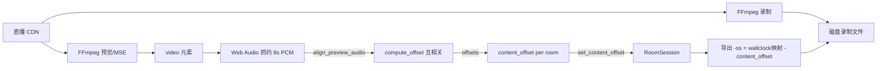
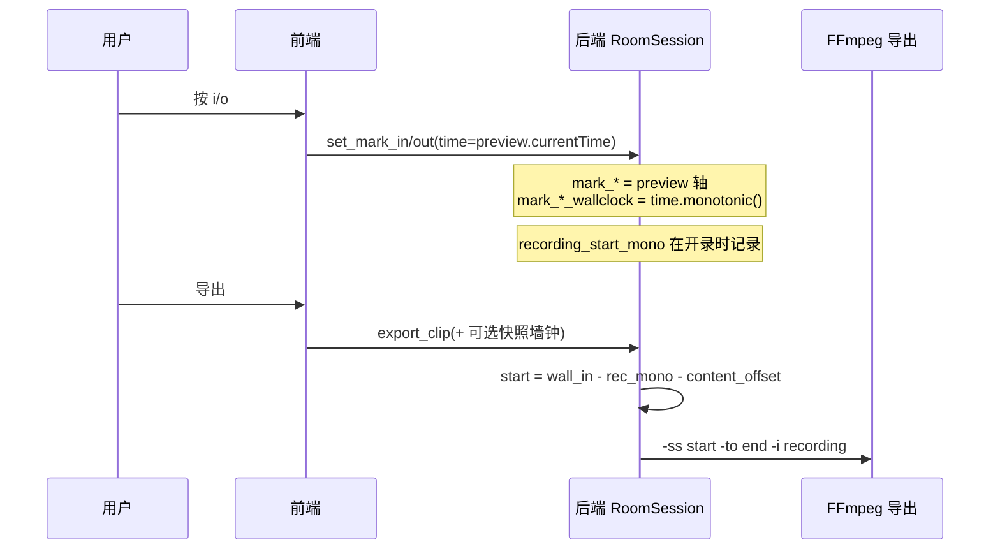
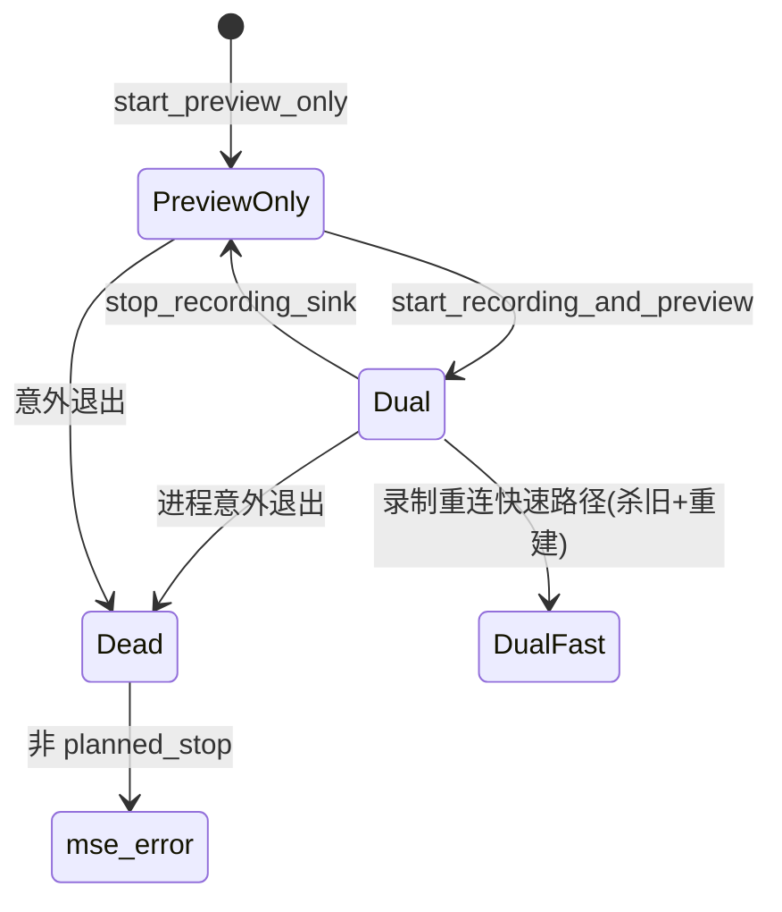
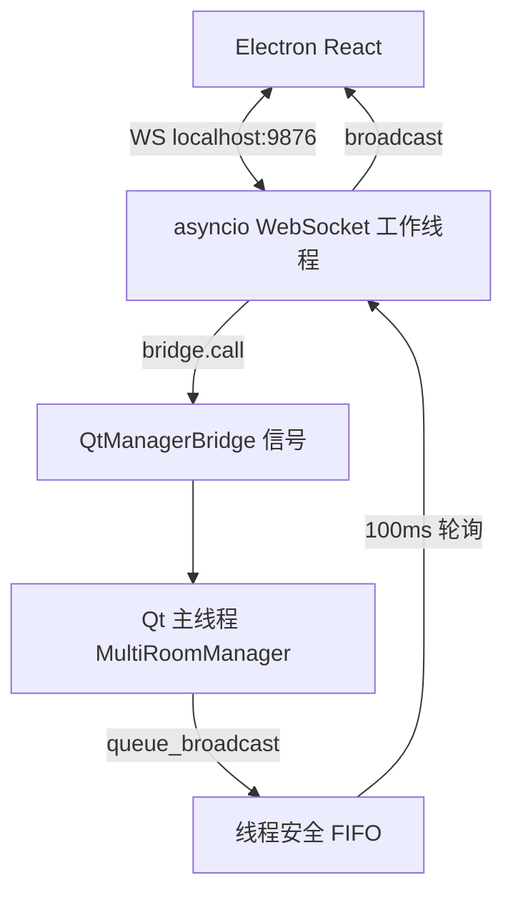
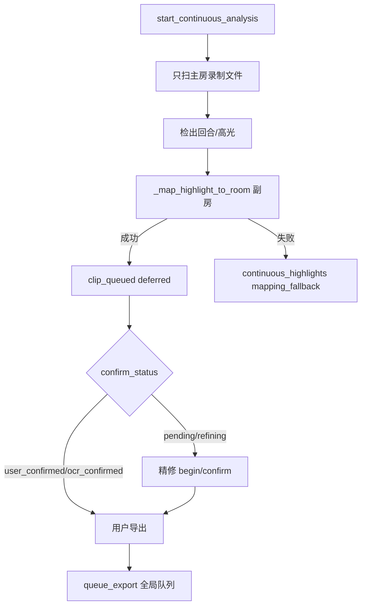

# LSC（Live Stream Clipper / 直播切片多人）— 完整系统生成提示词

> **用途**：本文档是一份可直接喂给 AI、用于**从零实现整个 LSC 程序**的权威规格。  
> **事实优先级**：以仓库真实代码为准；若与旧设计文档/`CLAUDE.md` 冲突，以代码行为为准（文中用「⚠️ 代码事实」标注）。  
> **生成日期上下文**：2026-07（基于当时仓库实现快照）。  
> **不要 commit 本文件以外的业务改动**；本文件本身即为交付物。

---

## Part 1：产品一句话 + 明确不做的事

### 1.1 一句话定位

**LSC 是 Windows 桌面端的多直播间录制与快速切片工具**：最多 **12 路并发录制**、**4 路并发 MSE 预览**；支持跨房间同步预览、一键音频对齐、墙钟精确映射导出、AI/持续分析高光入列与确认后导出。核心价值是「多路同录 + 对齐 + 快切」，不是剪辑软件。

### 1.2 明确不做（禁止做成）

| 禁止项 | 说明 |
|--------|------|
| 多轨道 NLE | 不做时间线非线性编辑、特效、转场、调色、字幕轨道 |
| 实时推流 | 不做 RTMP/SRT 直播推流、导播台 |
| 云端协作 | 不做账号体系、云同步、多用户权限 |
| 自动下载安装更新 | 仅手动检查 GitHub Release，浏览器下载；不做 electron-updater 静默安装 |
| 用预览 `currentTime` 当 FFmpeg `-ss` | 预览轴 ≠ 录制文件轴；必须墙钟映射或 ClipSnapshot |
| 持续分析自动 FFmpeg 导出 | AI 回合默认 `pending` + `export_deferred`，只入切片列表，须确认后再导出 |
| 分析副房录制文件 | 持续分析只分析主房录制文件，副房靠 `recording_start_mono` + `content_offset` 映射 |
| 扩大预览上限到 >4 | 硬上限 `MAX_CONCURRENT_PREVIEWS = 4` |
| PySide6 原生 GUI 预览（libmpv） | Electron 为唯一前端；Python Qt 仅作主线程业务宿主 |
| 静默吞异常 | 禁止无日志的 `except: pass`（清理路径除外且须 debug 日志） |

---

## Part 2：功能清单（面向用户）

### 2.1 多房间管理

- 添加直播间 URL → 解析平台 → 连接 → 显示主播名/标题/开播状态/画质。
- 房间上限：**12**（`MAX_ROOMS = 12`）。
- 多选房间：批量录制/停止、公共时间轴操作、持续分析目标集。
- 房间持久化：`data/rooms.json`（格式 `{"rooms":[...]}`，原子写 `.tmp` + `replace`）。
- 断连/删房：停预览、停录制、清理 MSE、必要时停持续分析、重置 `content_offset`。

### 2.2 平台支持与 Cookie

**适配器（无状态 Protocol）**：

| platform | 说明 |
|----------|------|
| `direct` | 直链 |
| `douyin` | 抖音（Cookie 辅助） |
| `bilibili` | B 站（Cookie/BiliSession） |
| `huya` | 虎牙 |
| `kuaishou` | 快手 |
| `douyu` | 斗鱼 |
| `xiaohongshu` | 小红书 |
| `weibo` | 微博 |
| `generic` | 未知页兜底，匹配 `<video>` |

**统一错误码**：`unsupported_url` / `offline` / `restricted` / `parse_failed`。

**画质候选预设名**：`原画` / `高清` / `标清` / `流畅`（`QUALITY_PRESET_CANDIDATES`）。

**Cookie UI**：设置页抖音/B站 Cookie 状态查询与保存（WS：`get_*_cookie_status` / `save_*_cookies`）。

**解析缓存**：成功 TTL 30s，失败 TTL 10s；host → 适配器快速路由。

### 2.3 连接 / 开播 / 画质

- `connect_room`：解析流地址、更新 `is_live`、qualities。
- `refresh_room_status`：批量刷新开播状态。
- 流 URL 过期前 **60s** 主动刷新；连接后房间级流缓存复用窗口 **120s**。
- 预览画质：`原画/高清/标清/流畅`，对应分辨率与码率预设（见 Part 4）。
- 多路预览降分辨率：≥6 路时 ≤854×480，≥8 路时 ≤640×360（动态策略，仍受 4 路预览上限约束）。

### 2.4 录制

- 单房 `start_recording` / `stop_recording`；快捷键 `r` / `Ctrl+R` / `Ctrl+Shift+R`。
- 录制启动并发：`asyncio.Semaphore(2)`，前端展示排队位 `recording_queue`。
- 编码器：`copy` / `libx264` / `libx265` / `h264_nvenc` / `h264_qsv` / `h264_amf` 等。
- **磁盘满保护**：录制中剩余空间 **< 2GB** 强制停录（`_MIN_FREE_BYTES_WHILE_RECORDING`）；新开录预检约 **8GB/流**（`RecordingService._MIN_FREE_BYTES_PER_STREAM`）。
- **重连**：最多 **3** 次，延迟 `2s × 2^n` 上限 **30s**；共享进样走快速路径（杀旧进程重建）。
- 录制文件三层校验：路径存在、大小 **>0.1MB**、格式魔数（MP4/`ftyp`、FLV/`FLV`、MKV/EBML）。
- 输出命名：`recording_{timestamp}_{suffix}.mp4`，按房间分子目录。
- 历史：`recording_history.json`。

### 2.5 MSE 预览

- 前端 Media Source Extensions 消费 fMP4（`ftyp+moov` init + `moof+mdat` media）。
- **独立双进程**（默认 `shared_ingest_enabled=False`）：录制 FFmpeg 与预览 FFmpeg 完全独立拉流。
- **共享进样**（`shared_ingest_enabled=True`）：单 FFmpeg 双输出（`-c copy` 录制 + libx264 预览 pipe）。
- 预览上限 **4**；`enable_preview {mode:"mse"}` 启停。
- 阶段广播 `preview_phase`：`idle|refreshing_url|probing|streaming|error`。
- MSE 自动重连最多 **3** 次，退避 2→4→8s（上限 30s）。
- init 竞态：后端缓存 `last_init_segment`；前端 `request_mse_init` 补发；前端模块级 init/segment 缓存。
- 前端 segment watchdog：约 **10s** 无数据则触发恢复。
- 二进制广播：`broadcast_binary(room_id, 'init'|'segment', bytes)`（另有 JSON `mse_init`/`mse_segment` 兼容路径）。

### 2.6 标记 / 切片列表 / 导出

- 入点 `i` / 出点 `o`；可拖拽、`[` `]` `{` `}` 微调。
- 写入：`mark_in/out`（预览 `currentTime`）+ `mark_in/out_wallclock`（`time.monotonic()`）。
- 切片列表：手动 / AI；状态 `queued|exporting|completed|failed|pending`。
- AI 确认状态（与导出正交）：`pending|refining|user_confirmed|ocr_confirmed`。
- 导出门禁：`pending`/`refining` 不可直接导出；「确认并导出」= 确认后立刻打开导出弹窗。
- 导出预设：抖音竖屏 / B站横屏 / 原画直出 / 高品质 / 小文件（见 Part 4）。
- ⚠️ **竖屏**：代码为「等比缩放入 1080×1920 + 黑边 pad」，**不是**中心裁剪 crop。
- 全局导出队列：4 worker + semaphore（并发 1 或 2，跟随 `export_max_concurrent`）。
- `cancel_export {job_id}`；进度 `export_progress`；完成 `clip_completed` / 失败 `clip_failed`。
- 前端乐观入队：提交失败必须回滚 `export_status`（监听 `export_clip_response` 与 `export_clip_by_id_response`）。

### 2.7 多房间音频对齐

- 前端从各房 `<video>`（**预览流**）抓约 **8s** PCM → base64 → `align_preview_audio`。
- 后端互相关窗口内部 `AUDIO_DURATION=3.0s`，`SAMPLE_RATE=16000` mono float32。
- 以**内容最慢**房间为基准；`content_offset ≥ 0`（相对最慢的非负偏移）。
- 置信度阈值 **0.3**（低于则该房降级 0）；前端信任阈值同 **0.3**。
- 成功后 `set_content_offset` + 构建 `TimelineContext`（`timeline_ready`）。
- 对齐中禁止 I/O、加切片、导出（交叉功能门禁）。

### 2.8 墙钟映射导出（三条路径）

见 Part 3 联动图谱。公式：

```
export_start = mark_in_wallclock - recording_start_mono - content_offset
export_end   = mark_out_wallclock - recording_start_mono - content_offset
```

AI 高光：`source=='ai_highlight'` 时直接用已映射到录制轴的 `start/end`（exact）。  
降级：无墙钟时 `start/end - content_offset`（approximate）；旧路径可用固定 `preview_latency`（默认 2.0s）。

### 2.9 AI / 持续分析

- 一次性：`start_analysis` / `start_analysis_export` / `cancel_analysis` / `get_analysis_results`。
- 持续：`start_continuous_analysis` / `stop_continuous_analysis` / `get_continuous_analysis_status`。
- **只分析主房录制文件**；副房映射后 `clip_queued`。
- Valorant 回合检测：OCR + onset/场景；相位调度（buy/pre_combat/combat/post_combat/intermission）。
- 质量优先档：密 OCR、BUY/COMBAT 始终 OCR、压力时仍可 OCR（见设计 spec 2026-07-15）。
- 双可信门：可自动升格导出需 OCR 边界可信；否则 `pending` 等人确认。
- 精修：`begin_refine_clip` / `confirm_highlight_clip` / `cancel_refine_clip` → `clip_confirm_status`。
- Modal：多房打开须保持 ≥2 目标房；主房 Radio 与 `target_room_ids` 同源。
- 映射失败：`continuous_highlights.mapping_fallback=true` + toast。
- 分析结果旁路持久化：录制同目录 `{stem}.analysis.json`（mtime 校验）。

### 2.10 公共时间轴 / TimelineContext / ClipSnapshot

- 三坐标系：`preview_local` / `common` / `recording_local`（见 Part 3）。
- `create_clip_snapshot`：公共入出点原子映射到多房；任一路失败整组回滚 `RANGE_UNAVAILABLE`；`clip_ready=false` → `CLIP_NOT_READY`。
- `export_clip_by_id`：按冻结录制坐标导出。
- `get_timeline`；失效广播 `timeline_invalidated`。

### 2.11 设置项（settings.json）

路径：`python-backend/settings.json`（⚠️ 默认值以 `load_settings()` 代码为准）。

| 键 | 默认（代码） | 说明 |
|----|-------------|------|
| `output_dir` | `~/LSC/output` | ⚠️ CLAUDE 写 recordings，代码为 output |
| `theme` | `dark` | 主题 |
| `encoder` | `h264_nvenc` | 录制/导出编码器偏好 |
| `quality` | `原画` | 拉流画质 |
| `param_mode` | `CRF 质量` | 或「自定义码率」 |
| `crf` | `23` | 0–51 |
| `bitrate` | `8000`（number） | kbps |
| `bitrate_unit` | `kbps` | |
| `resolution` | `原画` | |
| `framerate` | `原画` | |
| `audio_bitrate` | `128k` | |
| `preview_quality` | `高清` | |
| `default_export_preset` | `douyin_vertical` | |
| `export_max_concurrent` | `2` | 仅允许 1 或 2 |
| `ocr_accel` | `dml` | `auto`/`dml`/`cuda`/`cpu` |
| `shared_ingest_enabled` | （可选，默认 False） | 须同步到 `LscConfig` |
| `shared_ingest_preview_crf` | `23` | LscConfig |
| `shared_ingest_preview_preset` | `veryfast` | |
| `shared_ingest_preview_queue_bytes` | `2MB` | |
| `shared_ingest_preview_drop_policy` | `drop_oldest` | |

**Electron 本地 app-settings**（`userData/app-settings.json`）：`theme` / `language` / `autoLaunch` / `minimizeToTray`。

### 2.12 快捷键

| 功能 | 键 | action id |
|------|-----|------------|
| 工作台 | Ctrl+1 | `page:workbench` |
| 设置抽屉 | Ctrl+2 | `page:settings` |
| 刷新 | F5 | `page:reload` |
| 播放/暂停 | Space / K | `play:toggle` |
| 入点/出点 | I / O | `mark:in` / `mark:out` |
| 微调出点 | [ / ] | `mark:nudge-out-*` |
| 微调入点 | { / } | `mark:nudge-in-*` |
| 录制切换 | R | `record:toggle` |
| 静音 | M | `mute:toggle` |
| 全屏 | F | `fullscreen` |
| 批量录制/停止 | Ctrl+R / Ctrl+Shift+R | `batch:record` / `batch:stop` |
| 全选卡片 | Ctrl+Shift+A | `select:all` |
| 导出 | Ctrl+E | `export:clip` |

焦点在 input/textarea/select 或 Modal 打开时拦截（页面导航与 F5 除外）。

### 2.13 版本检查

- 手动：设置页 → IPC `check-for-update` → GitHub `Lawrence7y/LSC` latest release。
- 缓存 TTL **5 分钟**；超时 10s；打开浏览器下载，不自动安装。

### 2.14 系统托盘 / 生命周期 / 安全

- 托盘状态：`idle|recording|error`；最小化到托盘可选。
- 退出：主进程通知渲染清理房间；Windows `taskkill /T /F` 杀后端树。
- 路径白名单：`open-path` / `show-item-in-folder` 必须 `_isSafePath`（userData、`~/LSC`）；黑名单 `.exe/.bat/.ps1/.cmd/.vbs/.scr`。
- 后端环境变量白名单启动；Windows `detached=true`。

### 2.15 错误友好化与通知

- `humanize_error()`：中英正则映射；`is_recoverable_error()` 决定是否重连。
- 通知：窗口聚焦可跳过非关键；**关键始终通知**：`clip_failed`、`reconnect_failed`、`recording_stopped`、连接/录制失败、导出提交失败等。

### 2.16 UI / 设计系统要点

- 暗色 Apple HIG 风格；令牌：`--brand-500=#007aff`，`--bg-primary=#000`，`--bg-secondary=#1c1c1e`，圆角 14/10/18。
- Ant Design + 强制 `!important` 主题覆盖。
- 工作台：房间网格 + 控制条 + 时间线 + 切片列表；设置抽屉。
- 放大预览可用原生 controls；勿再叠加自定义竖向音量滑块。

### 2.17 依赖检测与系统监控

- `check_dependencies`：python/ffmpeg/ffprobe/nvenc。
- `get_system_stats` / 广播 `system_stats`：CPU/内存/磁盘。

---

## Part 3：功能联动图谱

### 3.1 预览对齐导出链



要点：对齐音频**永远来自预览流**，不是录制文件；`align_rooms`（文件提取）为死代码勿依赖。

### 3.2 标记墙钟映射



### 3.3 录制 ↔ 预览两种模式生命周期

**独立模式**：开预览只启 MseStreamer；开录制只启 StreamCapture；互不影响。停录不影响预览。

**共享进样**：



警告：共享模式下录制故障可拖垮预览；改画质/重启预览会使公共轴失效，需重新对齐。

### 3.4 WebSocket + Qt Bridge



- 请求：`{type, data}` → 响应 `{type}_response`。
- 高频广播降 DEBUG：`mse_segment`/`mse_init`/`rooms_updated`/`export_progress`/`medium_tick`。
- `rooms_updated` 合并：队列内连续同类型只保留最新。
- 端口：主 **9876**（`main.py`）；回退 **19877–19880**（⚠️ `server.py` 类默认写 19876，实际入口用 9876）。

### 3.5 持续分析闭环



### 3.6 导出队列联动

- 入队：`queue_export` → worker 池（4）→ `_export_semaphore`（1|2）。
- **禁止**读 `Semaphore._waiters`（空闲时为 `None`）；用 `_export_semaphore_limit` 热更新。
- 取消：`job_id` ∈ `_export_cancelled_jobs` + 杀 FFmpeg。
- 广播：`clip_export_started` → `export_progress` → `clip_completed`/`clip_failed`。
- 前端：乐观 `queued`；`success===false` 回滚。

### 3.7 MSE init 竞态

1. `enable_preview` → 刷新 URL（可 >10s，线程池）→ 启 FFmpeg。  
2. init 可能早于 `rooms_updated`/VideoPreview 挂载。  
3. 后端缓存 + `request_mse_init`/`replay_init`；前端模块缓存 init/segment。  
4. watchdog 10s 无 segment → 恢复。

### 3.8 时间线 windowStart 契约

| 坐标系 | 来源 | 用途 |
|--------|------|------|
| preview_local | MSE currentTime | 单房播放头 |
| common | preview + delta | 多房对齐后公共轴 |
| recording_local | 录制文件秒 / 墙钟差 | 导出与分析进度 |

**禁止**：用 `record_started_at` 墙钟差或 `recorded_duration` 参与 `windowStart`/播放头百分比（会把播放头钳到 0%）。

### 3.9 交叉功能门禁（已实现要点）

- 删房若在分析 target → 先停持续分析。  
- 精修只写本房 mark。  
- 刷新预览若公共轴 ready / 分析中 → 确认对话框。  
- 对齐中禁止标记/导出。  
- AI pending 写 mark 不得覆盖用户有效 mark。  
- 混选 live/review seek 时警告部分不同步。

---

## Part 4：Master Prompt（可复制给 AI 从零生成）

以下整段即为 **Master Prompt**。实现时必须遵守文中所有数字、消息名、公式与禁令。

---

```
你是资深全栈工程师。请从零实现名为 LSC（Live Stream Clipper）的 Windows 桌面应用：多直播间录制与快速切片工具。

════════════════════════════════════
A. 产品边界
════════════════════════════════════
定位：高效多路同步录制 + 预览 + 对齐 + 精确切片导出。最多 12 路录制、4 路 MSE 预览。
禁止：多轨道 NLE、特效转场调色、实时推流、云协作、自动静默更新安装、用预览 currentTime 直接当 FFmpeg -ss、持续分析自动导出、分析副房文件、预览>4 路、静默吞异常。

════════════════════════════════════
B. 技术栈与目录
════════════════════════════════════
三层架构：
1) 前端 Electron Render：React + TypeScript + Vite + Ant Design + Zustand
   目录 lsc-electron/
   - electron/main.ts：窗口、托盘、Python 生命周期、更新检查、安全路径 IPC
   - electron/preload.ts：暴露 electronAPI
   - src/pages/Workbench/：工作台（房间卡、控制条、时间线、切片列表、分析 Modal）
   - src/pages/Settings/：设置抽屉内容
   - src/services/websocket.ts / mediaSourcePlayer.ts
   - src/store/appStore.ts
   - src/utils/timelineCoords.ts：preview/common/recording 换算
   - src/hooks/useKeyboardShortcuts.ts / useWebSocket.ts / useNotifications.ts
   - src/styles/tokens.css + global.css

2) 桥接层 python-backend/（工作线程 asyncio WS + Qt 主线程）
   - main.py：入口，Qt 事件循环 + 启动 WS（host 127.0.0.1, port 9876）
   - server.py：LSCWebSocketServer；handler 注册；broadcast；binary MSE；rooms_updated 合并
   - message_bridge.py：QtManagerBridge（call 同步原语 + queue_broadcast）
   - persistence.py：rooms.json / analysis.json 旁路
   - handlers/room_handler.py：房间/录制/预览/对齐/导出队列/分析
   - handlers/timeline_handlers.py：create_clip_snapshot / export_clip_by_id / get_timeline
   - settings.json：运行设置

3) 核心包 lsc/
   - core/models.py：DTO（StreamQuality, RoomInfo, RecordingSession, Clip, TimelineContext, ClipSnapshot, ExportOptions…）
   - core/services/：recording_service, export_service, mse_streamer, shared_ingest, ingest_registry, timeline_service, resource_monitor
   - platforms/：Protocol + registry + 各平台适配器（无状态）
   - editor/audio_aligner.py：互相关对齐
   - exporter/clip.py：ClipExporter FFmpeg 裁切
   - analyzer/：回合/OCR/相位调度/onset（Valorant 持续分析）
   - gui/multi_room/manager.py：MultiRoomManager（Qt 主线程编排）
   - config.py：LscConfig / ExportProfile
   - utils/error_messages.py：humanize_error / is_recoverable_error

════════════════════════════════════
C. 并发与常量（必须一致）
════════════════════════════════════
MAX_ROOMS = 12
MAX_CONCURRENT_PREVIEWS = 4
录制启动 Semaphore = 2
磁盘：录制中停录阈值 2GB；新开录预检约 8GB/流
录制重连：最多 3 次，base 2s，factor 2，max delay 30s
MSE 重连：最多 3 次，退避 2→4→8（cap 30）
MSE 强制切分缓冲：512KB
导出：_MAX_EXPORT_WORKERS=4；_export_semaphore 默认 2，仅允许 settings 1|2
对齐：AUDIO_DURATION=3.0；前端捕获~8s；SAMPLE_RATE=16000；_CORRELATION_THRESHOLD=0.3；_ALIGN_TRUST_THRESHOLD=0.3
解析缓存 TTL：成功 30s / 失败 10s
流 URL 刷新阈值 60s；房间流缓存复用 120s
WS 端口：9876，回退 19877,19878,19879,19880
日志：RotatingFileHandler 2MB × 5
录制文件最小有效：>0.1MB + 格式魔数

════════════════════════════════════
D. 领域 DTO（core/models.py）
════════════════════════════════════
实现 slots dataclass，无业务方法（TimelineContext 可有纯换算方法）：
- StreamQuality(name, url)
- RoomInfo(platform, room_url, stream_url, title, streamer, is_live, qualities, selected_quality, headers, error, error_code, raw)
- RecordingStatus: idle|connecting|recording|paused|stopped|error|reconnecting
- RecordingSession(... duration_sec, file_size_mb, encoder, crf, bitrate, reconnect_attempts, max_reconnect_attempts=3)
- Clip(... mark_in_wallclock, mark_out_wallclock, content_offset, score_breakdown, highlight_reason, transcript)
- RoomTimeSnapshot / TimelineContext / ClipSnapshot（见下文换算公式）
- ExportOptions(codec=h264_nvenc, crf=23, preset=medium, audio_bitrate=128k, rate_mode=crf|bitrate|unrestricted, video_bitrate=8000k, resolution="", fps=0, vertical_crop=False, generate_thumbnail=True)

content_offset 符号：正值 = 该房内容领先基准（更快），导出时墙钟公式减去该偏移。

════════════════════════════════════
E. Timeline 换算
════════════════════════════════════
common = preview_local + preview_to_common_delta
common = recording_local + recording_to_common_delta
反向：preview = common - preview_to_common_delta 等。
UI 进度条 windowStart/displayCurrent 只能用与播放头同一轴（common 或 preview），禁止混用 recording 墙钟差。

════════════════════════════════════
F. 平台适配
════════════════════════════════════
Protocol PlatformAdapter:
  platform, display_name, can_handle(url)->bool, parse(url)->StreamInfo
无状态：parse 不得改实例属性。
错误码：unsupported_url, offline, restricted, parse_failed。
适配器：direct, douyin, bilibili, huya, kuaishou, douyu, xiaohongshu, weibo, generic(fallback)。
Registry：host 路由 + TTL 缓存 + 画质名映射 QUALITY_PRESET_CANDIDATES。

════════════════════════════════════
G. WebSocket 协议
════════════════════════════════════
请求：{"type":"<name>","data":{...}}
成功响应：{"type":"<name>_response","data":{...}}
异常：data 含 success:false 与 error。

【客户端→服务端 handlers（必须全部实现）】
房间：get_rooms, refresh_room_status, save_rooms, add_room, connect_room, disconnect_room, remove_room, set_preview_muted, set_preview_quality
录制：start_recording, stop_recording
播放：seek, toggle_play_pause, set_mark_in, set_mark_out
设置：get_settings, save_settings, get_disk_usage, get_system_stats, check_dependencies
Cookie：get_douyin_cookie_status, save_douyin_cookies, get_bilibili_cookie_status, save_bilibili_cookies
对齐：set_content_offset, align_preview_audio
预览：enable_preview, request_mse_init
导出：export_clip, cancel_export
分析：start_analysis, start_analysis_export, cancel_analysis, get_analysis_results,
      start_continuous_analysis, stop_continuous_analysis, get_continuous_analysis_status,
      begin_refine_clip, confirm_highlight_clip, cancel_refine_clip
时间线：create_clip_snapshot, export_clip_by_id, get_timeline

【服务端→客户端广播（必须）】
rooms_updated, rooms_loaded, room_updated,
mse_init, mse_segment, mse_error, mse_reconnecting, mse_reconnected,
preview_phase,
clip_completed, clip_failed, export_progress, clip_export_started, clip_queued, clip_confirm_status,
room_connect_finished, recording_started, recording_stopped, recording_queue,
system_stats, settings_loaded,
timeline_ready, timeline_invalidated, timeline_invalidated_broadcast, timeline_room_removed,
analysis_progress, highlight_stream, continuous_highlights, continuous_analysis_status, continuous_analysis_complete,
reconnecting, reconnect_failed（WS 客户端侧也可本地发射）

高频日志降级；rooms_updated 合并；大字段日志截断。
MSE 优先 binary：broadcast_binary(room_id, 'init'|'segment', bytes)。

Bridge：
- bridge.call(fn,*args,timeout=10) 经 Qt 信号在主线程执行并 Event 唤醒
- bridge.queue_broadcast(msg) 线程安全队列，WS 侧 ~100ms 泵出

════════════════════════════════════
H. 录制 / 预览实现要点
════════════════════════════════════
RecordingService + StreamCapture：按 encoder 拼 FFmpeg；copy 则 -c:v copy -c:a copy；NVENC 用 -rc vbr -cq {crf}。
独立模式：预览 MseStreamer 独立拉流，movflags frag_keyframe+empty_moov+default_base_moof；解析 ftyp/moov/moof/mdat。
共享进样 SharedRoomIngest：单进程双输出；preview CRF/preset 来自 LscConfig；planned_stop 区分计划关闭。
enable_preview 流程：refresh_stream_url（线程池）→ start → 广播 init → segments。
预览画质预设：
  原画: 0x0, nvenc 8000k, x264 crf20/6000k
  高清: 1280x720, 2500k, crf26/1800k
  标清: 854x480, 1500k, crf30/1000k
  流畅: 640x360, 800k, crf32/600k

════════════════════════════════════
I. 对齐算法
════════════════════════════════════
输入：多房间 PCM（预览捕获，~8s 前端 / 算法窗 3s），16kHz mono。
compute_offset：FFT 互相关 + 抛物线插值亚毫秒。
以最慢房间为基准，offsets 归零到非负。
score < 0.3 → 该房 offset=0。
成功后写 content_offset、构建 TimelineContext、广播 timeline_ready。
对齐中前端禁止 mark/add/export。

════════════════════════════════════
J. 导出映射与队列
════════════════════════════════════
_resolve_export_range 优先级：
1) source=='ai_highlight' → 直接 start/end（已是录制轴）exact
2) 完整墙钟快照 snap_in/out/rec → wall - rec - content_offset exact
3) use_room_marks + 房间墙钟 → 同上
4) 否则 start/end - content_offset approximate

竖屏 vertical_crop=True 滤镜（代码事实）：
  scale=1080:1920:force_original_aspect_ratio=decrease,pad=1080:1920:(ow-iw)/2:(oh-ih)/2:black
禁止实现成中心 crop=ih*9/16:...（旧文档错误）。

导出预设（前端 exportPresets.ts）：
- douyin_vertical：1080x1920, 30fps, h264_nvenc, crf23, vertical_crop true
- bilibili_horizontal：1920x1080, 30, h264_nvenc, 23
- original：copy
- high_quality：60fps, crf18, aac 256k
- small_file：1280x720, 24, hevc_nvenc, crf28, 96k

queue_export 统一入口；热更新 semaphore 用模块变量记录 limit，禁止访问 _waiters。
前端必须同时处理 export_clip_response 与 export_clip_by_id_response 失败回滚。

════════════════════════════════════
K. 持续分析 / 确认门
════════════════════════════════════
只分析主房录制文件。
副房：delta = (main_rec - target_rec) + (main_offset - target_offset) 一类映射（实现与 _map_highlight_to_room 一致），得到 export_start/end。
默认 list_only / export_deferred：clip_queued，confirm_status=pending。
可导出门：user_confirmed 或 ocr_confirmed（及手动切片无 confirm_status）。
精修：begin_refine → refining；confirm → user_confirmed；cancel 恢复。
Valorant：相位调度 + OCR（ocr_accel dml/cuda/cpu/auto）；质量优先档 BUY/COMBAT 始终 need_ocr。
删房/断主房停分析；mapping_fallback toast。
分析结果保存到 {video}.analysis.json，mtime 变化则 stale。

════════════════════════════════════
L. 前端状态与 UI
════════════════════════════════════
Zustand：rooms, clips, settings, connectionStatus, continuousAnalysisStatus, timelineContext, systemStats…
RoomSession 字段含 mark_*, wallclock, recording_start_mono, content_offset, mse_*, preview_phase, preview_mode(live_mse|recording_review|degraded), preview_epoch_id…
ClipSegment：export_status, confirm_status, round_key, mark_precision, clip_snapshot_id…
设计令牌暗色 Apple 风；Ant 组件 !important 主题覆盖。
快捷键表见 Part2；输入框焦点拦截。
通知策略：关键错误始终通知。

════════════════════════════════════
M. Electron 主进程
════════════════════════════════════
拉起 Python 后端（环境变量白名单，Windows detached）。
IPC：窗口控制、选目录、openPath/showItemInFolder（_isSafePath）、check-for-update（GitHub API，UA LSC-App/version，缓存 5min）、托盘、进度条、日志读取、退出 cleanup。
打包：extraResources 含 lsc/, python-backend/, scripts/；路径用 process.resourcesPath。

════════════════════════════════════
N. 设置默认（load_settings 代码事实）
════════════════════════════════════
output_dir=~/LSC/output, theme=dark, encoder=h264_nvenc, quality=原画,
param_mode=CRF 质量, crf=23, bitrate=8000, bitrate_unit=kbps,
resolution=原画, framerate=原画, audio_bitrate=128k, preview_quality=高清,
default_export_preset=douyin_vertical, export_max_concurrent=2, ocr_accel=dml,
shared_ingest_enabled 保存时同步 LscConfig。

════════════════════════════════════
O. 安全与错误规范
════════════════════════════════════
禁止 except Exception: pass（清理路径须 debug 日志）。
禁止 assert 做运行时校验。
顶部统一 import。
humanize_error 覆盖中英文磁盘/网络/403 等。
路径白名单 + 可执行后缀黑名单。
子进程 stdout 非阻塞防死锁。

════════════════════════════════════
P. 测试与验收（生成后必须）
════════════════════════════════════
pytest（QT_QPA_PLATFORM=offscreen）：平台适配、manager 上限、export semaphore、墙钟映射、对齐阈值、持续分析门禁、cross_feature_guards、ux/stability guards。
前端：npx tsc --noEmit。
手工：双房预览对齐→标记→导出时间正确；开共享进样生命周期；AI pending 不可直接导出；磁盘<2GB 停录；MSE init 竞态补发。

════════════════════════════════════
Q. 实现顺序建议
════════════════════════════════════
1) models + platforms + recording/export FFmpeg
2) MultiRoomManager + Qt bridge + WS server/handlers
3) Electron 壳 + Workbench UI + MSE player
4) 对齐 + 墙钟导出 + 导出队列
5) TimelineContext/ClipSnapshot
6) 持续分析 + 确认精修
7) 设置/Cookie/更新/托盘/安全
8) 测试与守卫

输出完整可运行仓库，中文 UI，遵守上述所有数字与消息名。若需取舍，优先正确的墙钟映射与预览/录制独立性，而非额外功能。
```

---

## Part 5：验收检查清单（AI 生成后自测）

### 5.1 架构与边界

- [ ] 存在三层目录：`lsc-electron/`、`python-backend/`、`lsc/`
- [ ] Electron 为唯一 UI；Qt 仅宿主业务主线程
- [ ] 无 NLE/推流/自动安装更新

### 5.2 常量与上限

- [ ] 房间 ≤12，预览 ≤4，录制启动并发 2
- [ ] 磁盘录制中 <2GB 停录；重连 3 次指数退避
- [ ] 导出并发仅 1|2；semaphore 热更新不碰 `_waiters`
- [ ] WS `9876` + 回退端口

### 5.3 协议完整性

- [ ] Part 4 列出的全部 `@server.on` handlers 均有实现与 `_response`
- [ ] 关键广播：`rooms_updated`（可合并）、MSE、导出、分析、timeline、recording_* 均可达前端
- [ ] `rooms_updated` 高频合并；高频消息不刷 INFO 日志

### 5.4 切片正确性（核心）

- [ ] `mark_in` 存 preview 时间，同时存 `mark_in_wallclock=monotonic`
- [ ] 导出使用 `wall - recording_start_mono - content_offset`，**不用** preview currentTime 当 `-ss`
- [ ] AI 高光用录制轴 start/end；手动优先墙钟快照
- [ ] 竖屏为 scale+pad 黑边，非中心 crop
- [ ] 导出失败前端回滚排队状态；cancel 可杀进程

### 5.5 对齐

- [ ] 音频来自预览 `<video>` PCM，非录制文件
- [ ] 阈值 0.3；最慢房基准；content_offset ≥0 约定一致
- [ ] 对齐成功产生 TimelineContext；对齐中禁止 mark/export

### 5.6 预览

- [ ] 独立双进程默认可用；shared_ingest 开关同步 LscConfig
- [ ] init 竞态：缓存 + `request_mse_init`
- [ ] MSE 重连与 10s watchdog
- [ ] 预览与录制可独立启停

### 5.7 持续分析

- [ ] 只分析主房；副房映射；失败 mapping_fallback
- [ ] 默认 pending 不自动导出；确认门禁生效
- [ ] 精修/确认/取消状态广播 `clip_confirm_status`
- [ ] 删主房/目标房停分析；多房 Modal ≥2 目标校验

### 5.8 时间线 UI

- [ ] windowStart 不混用 recording 轴
- [ ] timeline_invalidated 退出精修并提示重对齐

### 5.9 设置与平台

- [ ] settings 默认与 Part 4 表一致（含 `~/LSC/output`、`ocr_accel=dml`）
- [ ] 至少支持抖音/B站/虎牙/直链 + Cookie 流程
- [ ] 错误码四类齐全

### 5.10 安全与运维

- [ ] `_isSafePath` + 可执行后缀黑名单
- [ ] 后端环境变量白名单；退出杀进程树
- [ ] humanize_error；关键通知不因聚焦丢失
- [ ] `pytest` 与 `tsc --noEmit` 通过

### 5.11 端到端场景（手工）

1. 两房连接 → 开预览 → 一键对齐 → I/O 标记 → 导出 → 画面内容对齐且无系统性几秒偏移。  
2. 只录不看 / 只看不录。  
3. 开 shared_ingest：停录预览仍在；杀流预览报 mse_error。  
4. 持续分析出 pending → 不可导出 → 确认并导出成功。  
5. 磁盘空间模拟不足停录。  
6. 设置检查更新返回 available/not-available/error 之一。

---

## 附录 A：代码 vs 旧文档冲突一览（实现必须以代码为准）

| 主题 | 旧文档/CLAUDE | 代码事实 |
|------|---------------|----------|
| 默认 output_dir | `~/LSC/recordings` | `~/LSC/output` |
| 竖屏滤镜 | `crop=ih*9/16:...` 中心裁剪 | `scale+pad` 黑边适配 1080×1920 |
| 互相关阈值 | 0.1 | **0.3**（`_CORRELATION_THRESHOLD` / `_ALIGN_TRUST_THRESHOLD`） |
| WS 默认端口类定义 | 9876 | `server.py` 类默认 19876，但 `main.py` 传入 **9876** |
| settings resolution 默认 | `""` | `"原画"` |
| bitrate 类型 | 字符串 `"8000"` | number `8000` |

## 附录 B：近期设计补充索引（功能已吸收进上文）

- `docs/superpowers/specs/2026-07-15-continuous-analysis-quality-first-design.md` — 质量优先 OCR
- `docs/superpowers/specs/2026-07-16-cross-feature-twelve-fixes-design.md` — 交叉门禁十二条
- `docs/superpowers/specs/2026-07-16-ux-habit-fourteen-fixes-design.md` / stability / fps-round — UX 与稳定性
- `docs/superpowers/specs/2026-07-14-*` — 精修时间线、OCR GPU、clip 状态同步、Valorant 相位
- `docs/superpowers/specs/2026-07-15-live-dvr-boundary-offline-review-design.md` — 回看/DVR 边界

---

**文档结束。** 将 **Part 4 Master Prompt** 整段复制给实现用 AI；用 **Part 5** 做验收。细节冲突时回看附录 A 与仓库源码。
