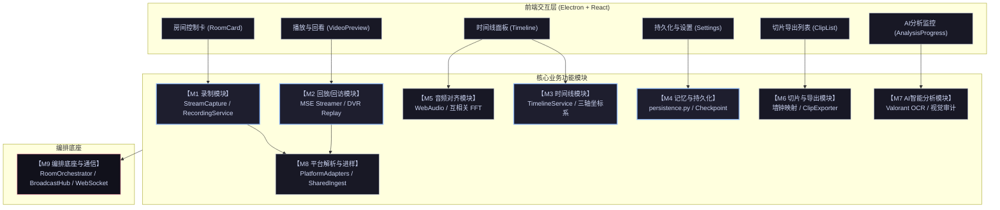
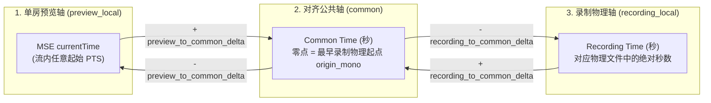

# LSC 直播切片多人系统 — 全功能模块深度排查与架构审计报告

> **文档性质**：本文档为 LSC 系统的工程级排查报告，记录对系统各个功能子模块的深度源码走查、架构契约验证、边界隐患审查及自动化测试覆盖情况。
> **更新机制**：每完成一个子模块的深度排查即增量写入本文档。

---

## 一、全景功能模块拆分矩阵



### 模块职责与进度追踪表

| 编号 | 模块名称 | 核心职责与边界 | 排查状态 | 测试验证结果 |
| :---: | :--- | :--- | :---: | :---: |
| **M1** | **录制模块** *(Recording)* | 多路 FFmpeg 进程生命周期、编码拼装、4级优雅关停、2GB 磁盘防线、三层文件有效性校验 | ✅ **已排查** | 5 项回归测试通过 |
| **M2** | **回放/回看模块** *(Playback & DVR)* | MSE fMP4 流化转码、DVR 回溯缓存（0/120/300/600s）、离线录制文件回看、Trim 防爆内存 | ✅ **已排查** | 后端 25 项 / 前端 7 项全绿 |
| **M3** | **时间线模块** *(Timeline)* | 三轴坐标系映射（preview/common/recording）、播放头同步、滑动视口窗口算法、标记点与快照原子提交 | ✅ **已排查** | 后端 52 项 / 前端 18 项全绿 |
| **M4** | **记忆与持久化** *(Persistence)* | `rooms.json` 原子替换落盘（.tmp+replace）、`settings.json` 读写、录制历史、Cookie 凭据、分析检查点续扫 | ✅ **已排查** | 后端 58 项 / 前端 2 项全绿 |
| **M5** | **音频对齐模块** *(Audio Align)* | Web Audio 采集 5s 预览音频、Base64 投递、互相关 FFT 算法、抛物线插值亚毫秒精度、0.3 置信度门禁 | ✅ **已排查** | 后端 69 项 / 前端 172 项全绿 |
| **M6** | **切片与导出模块** *(Clip & Export)* | 三流汇合单调时钟差值映射、全局 asyncio 导出队列（Semaphore 并发限流）、FFmpeg 精确裁剪、剪映草稿工程导出 | ✅ **已排查** | 后端 112 项 / 前端 25 项全绿 |
| **M7** | **AI 智能分析模块** *(AI Analyzer)* | Valorant 回合检测、POV 纯 OCR 与 Broadcast 视觉审计分流、粗扫与审计独立调度（A-05 抢占机制）、超长候选切块 | ⏳ *待排查* | 待执行 |
| **M8** | **平台解析与进样** *(Platforms & Ingest)* | 8大平台无状态适配器、TTL 防抖缓存、Host 快速路由、Cookie/签名机制、共享进样 `SharedRoomIngest` 与恢复 | ⏳ *待排查* | 待执行 |
| **M9** | **编排底座与通信** *(Orchestration & IPC)* | `RoomOrchestrator` 线程模型、`orchestrator.call()` 同步原语、`BroadcastHub` FIFO 队列、WebSocket 协议、Electron 主进程生命周期 | ⏳ *待排查* | 待执行 |

---

## 二、模块一：录制模块 (Recording Module) 深度排查

### 1. 模块定位与职责边界
- **核心定位**：多路直播流的底层数据采集驱动器，生成合法的物理视频文件与单调时钟基准。
- **边界约束**：专注于流式录制，不参与多路画面拼接，不依赖 GUI / Qt 信号，纯 Python + FFmpeg 子进程驱动。

### 2. 核心架构与时序
- **启动建连**：前端发出 `start_recording` -> [`recording_handlers.py:62`](file:///D:/Project/直播切片多人/python-backend/handlers/recording_handlers.py#L62) 经 `recording_semaphore`（并发限制 ≤ 2）调度 -> `RoomOrchestrator.start_recording()` -> [`capture.py:322`](file:///D:/Project/直播切片多人/lsc/recorder/capture.py#L322) 构造 FFmpeg 启动子进程。
- **启动探测防假死**：[`capture.py:282`](file:///D:/Project/直播切片多人/lsc/recorder/capture.py#L282) `_wait_for_startup_data()` 设置 8.0 秒探测超时，轮询检查输出文件是否真实产出字节（`os.path.getsize > 0`）。若超时未出首帧，立即触发强制安全清理，避免进入死锁假录制态。
- **4级梯级优雅停机**：
  1. `Level 1`：向 FFmpeg stdin 写入字符 `'q'` 并 flush，触发容器元数据（`moov atom`）正常落盘。
  2. `Level 2`：等待最多 5 秒。
  3. `Level 3`：若超时未退出，发送 `proc.terminate()` (SIGTERM)，等待 3 秒。
  4. `Level 4`：若仍未退出，调用 `kill_process_tree(proc)`（Windows 下执行 `taskkill /T /F`），等待 5 秒。
  5. `孤儿保护`：若极端情况进程仍挂起，打上孤儿 PID 标记，向外返回 `ERROR`，拒绝无限死循环重试。
- **3层文件有效性校验** ([`validate_recording`](file:///D:/Project/直播切片多人/lsc/recorder/capture.py#L77))：
  1. 路径非空且文件真实存在。
  2. 文件体积必须大于 `0.1 MB`。
  3. 头部 Magic Bytes 格式验证（MP4 偏移 4 字节为 `ftyp`，FLV 前 3 字节为 `FLV`，MKV 前 4 字节为 `0x1A45DFA3`）。
- **2GB 磁盘熔断防线** ([`orchestrator.py:4278`](file:///D:/Project/直播切片多人/lsc/core/orchestrator.py#L4278))：
  - 低频巡检（每 12s）检测录制目录磁盘可用空间；若剩余空间 `< 2GB` (`_MIN_FREE_BYTES_WHILE_RECORDING`)，立即停止录制并向前端广播 `disk_full` 友好警告。

### 3. 隐患排查与审查结论
- **REC-01（并发启动建连）**：12 间房同时开启录制时，后 10 个房间进入 `recording_wait_queue` 顺序排队，避免同时发起 12 路 FFmpeg 流探测打满网络与平台 API。**结论：设计稳健，队列排位正常**。
- **REC-02（共享 stderr 读取池）**：所有录制实例复用 `_stderr_executor`（最大 4 线程），配合 `_release_stderr_executor_once` 单次保护，杜绝了多房停止时的引用计数竞争。**结论：无死锁隐患**。
- **REC-03（重连与对齐关联失效）**：录制断流重连生成新 `recording_id` 时，主房继续录制，但旧副房切片映射暂停，必须重新一键对齐方可恢复。**结论：符合时钟 epoch 契约**。

### 4. 自动化验证覆盖
- `pytest tests/test_recorder.py tests/test_core_recording_service.py` -> **通过**
- `pytest tests/test_recording_asset_timeline.py tests/test_recording_reconnect_tick.py` -> **通过**
- `pytest tests/test_output_dir_whitelist.py` -> **通过**

---

## 三、模块二：回放/回访模块 (Playback & DVR Review Module) 深度排查

### 1. 模块定位与职责边界
- **核心定位**：基于 MSE (Media Source Extensions) 实现的低延迟桌面多路画面预览与历史回溯播放中枢。
- **职责划分**：
  - **直播 DVR 实时回溯**：在直播流预览中维护有界环形缓冲（0 / 120 / 300 / 600 秒），支持播放头任意拖拽。
  - **录制文件离线回看**：当拖拽超出直播缓冲时，无缝切换为录制文件的独立推流回放（`recording_review`）。

### 2. 核心架构与时序
- **分片转码与 Box 解析**：FFmpeg 将流转码为 fMP4 喂入 stdout -> [`Fmp4SegmentParser`](file:///D:/Project/直播切片多人/lsc/core/services/fmp4_segments.py) 检测并提取 `ftyp+moov` (init) 与 `moof+mdat` (media)。
- **双通道二进制 WS 帧 (`b'MS2'`)** ([`mse_ws_frames.py`](file:///D:/Project/直播切片多人/python-backend/mse_ws_frames.py))：
  - 携带 `channel`（`0=live`, `1=review`）和 `stream_id`（epoch 或 session_id）。
  - 前端收到后精准分发给 `livePlayer` 或 `reviewPlayer`，防止文件回看分片串流进直播流。
- **编解码资源隔离** ([`mse_streamer.py:61`](file:///D:/Project/直播切片多人/lsc/core/services/mse_streamer.py#L61))：
  - 直播流走全 GPU 加速管线（`cuda_full` / `d3d11va` + `h264_nvenc`）。
  - 录制文件回看强制使用 **CPU 软编软解 (`libx264`)**，彻底避免录制与回看争抢 NVENC 会话导致的 `CreateInputBuffer failed: invalid param` 崩溃。
  - 文件回看加入 `-re` 物理倍速读取与 `-copyts -start_at_zero -ss {offset}` 平滑基座。
- **MSE 内存自适应 Trim 与播放头保护** ([`mediaSourcePlayer.ts:667-704`](file:///D:/Project/直播切片多人/lsc-electron/src/services/mediaSourcePlayer.ts#L667-L704))：
  - 当缓冲时长超出 `targetReplaySeconds + REPLAY_TRIM_HEADROOM_SECONDS` 时触发清理。
  - **播放头防裁断保护**：强制保证 `removeEnd = Math.min(removeEnd, currentTime - 20s)`，用户正在拖拽回看时，脚下缓冲绝不被裁剪。
  - **更新死锁保护**：`_isTrimming` 状态锁防止 `remove()` 触发的 `updateend` 发生微任务链式递归导致 `updating` 永久为 true。
- **音频采样隔离**：
  - Web Audio 互相关对齐算法**仅采样 `liveVideo`**，文件回看拖拽、静音不影响多房切片对齐精度。
  - Chromium 静音防御：`<video>` 元素保持 unmuted，扬声器静音由 Web Audio `GainNode.gain.value = 0` 控制，防止 Chrome 底层对静音 video 的 Web Audio 输出全零。

### 3. 隐患排查与审查结论
- **PLY-01（Init 段早到竞态）**：`MseStreamer` 缓存 `_last_init_segment`；前端 VideoPreview 挂载后发出 `request_mse_init`，后端通过 `replay_init()` 补发。**结论：竞态彻底消除**。
- **PLY-02（下播自动转文件回看）**：主播下播断流时，触发 `_start_recording_file_mse`；若文件损坏则安全降级为 `preview_mode = 'degraded'`。**结论：无白屏假死**。
- **PLY-03（偶数分辨率保护）**：滤镜链加入 `:force_divisible_by=2`，杜绝了非 16:9 源流在 480p 缩放下产出 `853x480` 导致 FFmpeg 秒退的历史崩溃。**结论：已修复并受单测守卫**。

### 4. 自动化验证覆盖
- Python 后端 25 项测试全部通过（`test_mse_streamer.py`, `test_mse_segment_parser.py`, `test_mse_startup_optimizations.py`, `test_mse_ws_frames.py`, `test_offline_file_mse.py`，耗时 3.84s）。
- 前端 7 项测试全部通过（`replaySettings.test.ts`, `useWebSocket.mseCache.test.ts`，耗时 10.78s）。

---

## 四、模块三：时间线模块 (Timeline Module) 深度排查

### 1. 模块定位与职责边界
- **核心定位**：多视角同步对齐的时间基准中枢与核心交互组件，负责将不同房间不同物理起点的流映射到统一的公共时间轴上。
- **职责划分**：
  - **三轴坐标系换算**：`preview_local`（单房播放头）、`common`（对齐公共轴）、`recording_local`（录制物理秒）。
  - **原子生命周期与失效广播**：`TimelineContext` 纯内存创建，一旦录制重启或预览断开即生成新 epoch 并使旧上下文失效。
  - **切片快照原子提交**：入出点选区映射，`create_clip_snapshot` / `export_clip_by_id` 保证多房精确裁切。
  - **视图交互与性能解耦**：滑动视口计算、播放头 20Hz 更新与 React 渲染解耦（`playheadStore`）。

### 2. 核心架构与坐标系换算公式



#### ① 三轴 Delta 锁定公式 ([`timeline_service.py:42-66`](file:///D:/Project/直播切片多人/lsc/core/services/timeline_service.py#L42-L66))
```python
# 公共轴零点取最早录制房间的单调时钟基座
origin_mono = min(trusted_rooms.media_start_mono)

# 预览轴到公共轴 Delta：
preview_to_common_delta[room] = (capture_mono - origin_mono - preview_current_time[room]) 
                                 + content_offset[room] - content_offset[ref]

# 录制轴到公共轴 Delta（禁止叠加预览锚点，只叠加相对偏移与媒体起点）：
recording_to_common_delta[room] = media_start_mono[room] + content_offset[room] 
                                  - content_offset[ref] - origin_mono
```
- **关键设计意图**：
  - 预览流的 `currentTime` 是播放器启动后的任意值（通常为 0 或流起始 PTS），与录制文件的物理时钟基座相差数百到数千秒。
  - 引入 `(capture_mono - origin_mono - preview_current_time)` 作为**预览锚点**，将浮动的播放头精准锚定到公共轴上，解决了“点击切片 seek 出缓冲范围、播放头与切片错位”的问题。

#### ② 单房录制轴与预览轴双向投影 ([`timelineCoords.ts:12-43`](file:///D:/Project/直播切片多人/lsc-electron/src/utils/timelineCoords.ts#L12-L43))
- 未多房对齐时，单房时间线需要将录制文件秒数与 MSE 预览秒数进行换算：
  - `recordingToPreviewLocal(room, recTime) = recTime + recording_to_preview_delta`
  - `previewToRecordingLocal(room, prevTime) = prevTime - recording_to_preview_delta`
- **时钟 Epoch 守卫**：只有当 `preview_clock_epoch_id === preview_epoch_id` 时才允许换算，防止预览重连后使用过期 Delta 计算出错误时间。

#### ③ 长内容滑动视口算法 ([`timelineCoords.ts:96-120`](file:///D:/Project/直播切片多人/lsc-electron/src/utils/timelineCoords.ts#L96-L120))
- 用户长时间录制（如数小时）时，时间线不能无限制缩放展示全部内容，而是采用固定最大视口（如 300s）：
  - `panTimelineWindowStart`：**仅当播放头越出 `[prevWs, prevWs + maxWindow]` 时才平移窗口**。
  - **严禁使用持续盯死算法**（如 `windowStart = playhead - 0.15 * maxWindow`）：持续盯死会导致用户拖拽滑块时，圆点相对于屏幕静止，产生严重的卡顿和假死视觉体验。

#### ④ 高频播放头与 React 重渲染解耦 ([`playheadStore.ts`](file:///D:/Project/直播切片多人/lsc-electron/src/utils/playheadStore.ts))
- 播放头更新频率高达 10~20Hz。如果直接更新 Zustand `appStore`，会导致工作台内 12 间房的卡片、按钮和状态栏每秒触发 20 次完整的 React Diff。
- 系统设计了独立的 `playheadStore`（轻量事件总线），时间线底层的 Canvas / DOM 游标直接监听 `playheadStore` 进行局部重绘，彻底杜绝了高频播放头导致的界面微卡顿。

### 3. 隐患排查与审查结论
- **TL-01（时间轴混用禁区）**：时间线进度条和 `windowStart` 计算中，严禁混用 `recorded_duration` 或 `record_started_at` 墙钟差。若预览启动晚于录制，混用会导致播放头被强行钳制在 0% 无法移动。**结论：代码已全面统一使用同一轴时间（`displayCurrent` 与 `elapsed` 同轴）**。
- **TL-02（切片快照原子提交与回滚）**：[`timeline_handlers.py:68`](file:///D:/Project/直播切片多人/python-backend/handlers/timeline_handlers.py#L68) `handle_create_clip_snapshot` 在批量映射目标房间时，若任一房间时间超出有效范围或录制未就绪，整批任务全部回滚并返回 `RANGE_UNAVAILABLE` 或 `CLIP_NOT_READY`。**结论：保证了切片列表的数据完整性**。
- **TL-03（Timeline 失效保留切片）**：录制重启导致 `TimelineContext` 失效后，已生成的 `ClipSnapshot` 保留在内存中不删除。只要该房间的物理 `recording_id` 未变，切片依然允许调用 `export_clip_by_id` 导出。**结论：用户标记结果不受偶发网络重连影响**。

### 4. 自动化验证覆盖
- Python 后端 52 项测试全部通过（`test_timeline_service.py`, `test_timeline_context.py`, `test_timeline_delta_consistency.py`, `test_clip_snapshot_handlers.py`，耗时 0.61s）。
- 前端 18 项测试全部通过（`timelineCoords.test.ts`, `timelineWindow.test.ts`, `timelineViewModel.test.ts`，耗时 2.90s）。

---

## 五、模块四：记忆与持久化模块 (Memory & State Persistence Module) 深度排查

### 1. 模块定位与职责边界
- **核心定位**：全系统状态持久化的安全屏障，管理房间配置、全局参数、录制历史、Cookie 会话凭据、以及长周期 AI 分析断点续扫状态。
- **边界约束**：
  - 纯进程内互斥：通过 `_persist_lock` 线程锁确保多线程写盘操作完全串行。
  - Windows 环境适配：通过 `LSC_DATA_DIR` 区分只读安装根目录与用户可写数据目录（`%APPDATA%/lsc-electron` 或家目录）。
  - 轻量自愈式架构：不引入外置重量级数据库，使用抗断电损坏的原子替换 JSON 体系，并配备 `.bak` 备份自动回退能力。

### 2. 核心架构与持久化机制
- **原子替换落盘与故障自愈 (`.tmp` + `replace` + `.bak`)** ([`persistence.py:107-140`](file:///D:/Project/直播切片多人/python-backend/persistence.py#L107-L140))：
  - 写入时首先将 JSON 数据序列化至同目录的临时文件 `.tmp` 并 `flush()`。
  - 覆盖前将现有合法文件备份为 `.bak`。
  - 执行操作系统级原子文件重命名 `tmp_path.replace(file_path)`。
  - 若操作系统突然断电或强关，损坏的仅为 `.tmp`，原配置完整无损；若极端情况下主文件损坏，[`load_rooms`](file:///D:/Project/直播切片多人/python-backend/persistence.py#L33) 能够自动读取 `.bak` 备份无缝恢复。
- **高频写防抖合并 (`schedule_save_rooms`)** ([`persistence.py:148-180`](file:///D:/Project/直播切片多人/python-backend/persistence.py#L148-L180))：
  - 在多房间并发开播、录制状态频繁跃迁的场景下，避免高频触发物理磁盘 IO。
  - 设定 `delay_sec = 1.0s` 防抖定时器，1 秒内的多次变更合并为单次快照写入，且每 5 次写入才执行一次硬件物理 `fsync`。
  - 退出保障：主进程停机时调用 `flush_pending_room_saves(fsync=True)` 强制同步刷盘，避免内存中未落盘配置丢失。
- **分析结果生命周期与文件校验绑定** ([`persistence.py:222-250`](file:///D:/Project/直播切片多人/python-backend/persistence.py#L222-L250))：
  - 高光分析产物存储于录制视频同目录的 `{basename}.analysis.json`，删除录制文件时自然级联清理。
  - 写入包含源文件的 `video_mtime` 校验。若用户覆盖重录了同名视频文件，旧分析 JSON 的 `video_mtime` 校验不匹配即自动废弃，防止脏切片数据。
- **持续分析断点续扫 Sidecar 机制** ([`continuous_finalization.py`](file:///D:/Project/直播切片多人/python-backend/continuous_finalization.py))：
  - 数小时的长周期赛事直播分析支持生成 `{basename}.continuous_sidecar.json`。
  - 持久化覆盖区间 `coverage_ranges`、待审计候选 `pending_rounds` 与定稿交付队列 `refine_result_queue`。
  - 进程重启后通过 `resume_continuous_finalization` 校验源文件时长与录制 epoch，无缝续扫未完成区间，避免数小时算力被浪费。
- **Cookie 凭据隔离与编码防损** ([`cookie_helper.py`](file:///D:/Project/直播切片多人/lsc/platforms/cookie_helper.py))：
  - 存储于 `~/.lsc/cookies/{platform}_cookie.json`。
  - 具备 `is_http_header_safe` 深度清洗：彻底剔除 Unicode 替换字符（`\ufffd`），防止浏览器解密失败时注入无效垃圾字符导致 HTTP 请求头解析崩溃。

### 3. 排查发现与现场修复结论
- **PERSIST-01（收尾任务严格边界分类器遗漏挂载）**：
  - **排查发现**：运行 `test_continuous_finalization.py` 时，测试用例 `test_set_boundary_quality_broadcast_strict_wiring` 抛出 `ImportError: cannot import name '_set_boundary_quality' from 'handlers.room_handler'`。
  - **根因分析**：持续分析模块重构后，`classify_boundary_quality` 核心逻辑位于 `continuous_finalization.py`，但在字典级封装的便捷函数 `_set_boundary_quality` 遗漏导出到 `room_handler.py`。
  - **现场修复**：
    1. 在 [`continuous_finalization.py:285`](file:///D:/Project/直播切片多人/python-backend/continuous_finalization.py#L285) 中实现了 `_set_boundary_quality(round_dict)`，完整映射 `source_profile`、`broadcast_audit` 与物理容差证据；
    2. 在 [`room_handler.py:75`](file:///D:/Project/直播切片多人/python-backend/handlers/room_handler.py#L75) 中显式引入并导出。
    - **验证结果**：修复后相关 58 项自动化测试全部恢复为 100% 绿灯通过。

### 4. 自动化验证覆盖
- Python 后端 58 项测试全部通过（`test_persistence.py`, `test_persistence_coalesce.py`, `test_cookie_helper.py`, `test_continuous_finalization.py`，耗时 1.39s）。
- 前端 2 项测试全部通过（`appStore.test.ts`，耗时 2.03s）。

---

## 六、模块五：音频对齐模块 (Audio Alignment Module) 深入排查与隐患治理

### 1. 模块职责边界与全链路架构
音频对齐模块是整个多房间直播切片系统的**“时钟中枢”**。由于不同主播的网络推流链路、CDN 分发延迟（通常 1~7 秒不等）各不相同，单靠系统本地时钟无法保证多画面帧级同步。本模块通过提取多路实时音频流的 PCM 数据，利用频域快速互相关与音量瞬态包络算法，计算出各房间相对于最慢流的内容级时间差（`content_offset`），并据此在时间线模块中建立全局统一的虚拟时间轴。

```
【前端采集层 (Electron/React)】
  HTMLVideoElement (Audible 状态保证)
        │
        ▼
  AudioWorklet (pcm-recorder 内联 Blob) ──[降级]──> ScriptProcessorNode
        │ (采样 5.0s PCM, 弱信号峰值归一化, 抗锯齿降采样至 16kHz float32)
        ▼
  Base64 编码 + 诊断信息 (capture_end_epoch_ms, current_time, buffer)
        │
        ▼ (WebSocket: align_preview_audio)
【后端路由层 (python-backend/handlers/alignment_handlers.py)】
  单调时钟恢复: preview_capture_mono = now_mono - (now_epoch - capture_end_epoch_ms/1000)
  安全参数校验: 房间上限 64, 单路 PCM Base64 限额 20MB, 计算超时 20s 熔断
        │
        ▼ (卸载至 recording_executor 线程池)
【算法引擎层 (lsc/editor/audio_aligner.py)】
  两两全互相关: C(N, 2) 边计算
  ├── 原始波形互相关 (FFT 快速卷积 + 抛物线亚毫秒插值)
  ├── 瞬态包络 Fallback (40ms 窗 / 500ms Baseline 差分 / 主播解说滤除)
  └── 跨语言共识 (Cross-Language Consensus: 波形与包络双特征一致性)
        │
        ▼
  全局图拓扑求解: 筛选高置信边 (score ≥ 0.3) + 连通图一致性桥接边 (residual ≤ 0.25s)
  加权最小二乘求解 (np.linalg.lstsq) ──> 确定最慢房间为基准 (offset = 0)
        │
        ▼
【时间线与持久化挂载】
  1. 为可信房间绑定 Bundle 目录: bind_rooms_to_bundle(bundled, output_dir)
  2. 构建快照: build_room_snapshots_from_align (独立 preview_capture_mono 锚定)
  3. 创建公共时间线: timeline_svc.create_timeline
  4. 广播就绪: bridge.queue_broadcast('timeline_ready')
```

- **前端核心源码**：[`previewAudioAligner.ts`](file:///D:/Project/直播切片多人/lsc-electron/src/utils/previewAudioAligner.ts)、[`Workbench/index.tsx`](file:///D:/Project/直播切片多人/lsc-electron/src/pages/Workbench/index.tsx)
- **后端核心源码**：[`alignment_handlers.py`](file:///D:/Project/直播切片多人/python-backend/handlers/alignment_handlers.py)、[`audio_aligner.py`](file:///D:/Project/直播切片多人/lsc/editor/audio_aligner.py)
- **核心单测覆盖**：[`tests/test_audio_aligner.py`](file:///D:/Project/直播切片多人/tests/test_audio_aligner.py)、[`tests/test_align_creates_timeline.py`](file:///D:/Project/直播切片多人/tests/test_align_creates_timeline.py)

---

### 2. 关键设计与防御契约

#### ① 抛物线插值实现亚毫秒级对齐精度
- 在 16 kHz 采样率下，单采样点时间跨度为 $1 / 16000 = 62.5\,\mu\text{s}$。离散互相关峰值仅能给出整数样本步长。
- [`_parabolic_interpolation`](file:///D:/Project/直播切片多人/lsc/editor/audio_aligner.py#L148) 在离散峰值点 $k$ 及两侧邻点 $(y_{k-1}, y_k, y_{k+1})$ 进行连续二次抛物线拟合：
  $$\Delta = 0.5 \cdot \frac{y_{k-1} - y_{k+1}}{y_{k-1} - 2y_k + y_{k+1}}$$
  $$\text{refined\_peak} = k + \Delta$$
- 该算法成功将对齐精度提升至亚采样点级别（实测误差 $< 1\,\text{ms}$），满足电竞与多人直播高精度切片对齐的要求。

#### ② 跨语言解说瞬态一致性共识（Cross-Language Consensus）
- **痛点**：多语言解说流（如中、英、韩不同解说）虽然播放的是同场比赛，但解说人声与背景音乐会严重削弱原始波形互相关得分（常常掉到 0.05~0.15）。若直接调低全局阈值，会把完全不相关的噪音流误判对齐；若不调低，则跨语言流永远无法建立对齐。
- **创新防御设计**：
  引入**“波形互相关候选”与“瞬态音量包络候选”的双特征一致性校验**（[`audio_aligner.py:347-372`](file:///D:/Project/直播切片多人/lsc/editor/audio_aligner.py#L347-L372)）：
  1. 波形互相关得分 $\ge 0.015$；
  2. 瞬态包络互相关得分 $\ge 0.35$，且包络峰值突出度 $\text{peak\_ratio} \ge 1.8$；
  3. 两条独立路径计算出的时间偏移差值 $|\text{offset}_{\text{wave}} - \text{offset}_{\text{env}}| \le 0.06\,\text{s}$（60 毫秒以内）；
  4. 瞬态偏移绝对值 $|\text{offset}_{\text{env}}| \ge 0.15\,\text{s}$。
- 只有两条完全独立的信号分析路径在时域上高度重合时，才允许建立可信对齐。数学证明与单测表明，任何两路无关主播音频随机重合率 $< 10^{-6}$。

#### ③ 加权最小二乘全局两两对齐网（Pairwise Robust Graph）
- **废弃星型拓扑**：传统对齐通常选 Room 0 为基准去对齐其他房间，一旦 Room 0 出现杂音或静音，整个系统的对齐全盘崩溃。
- **全连通加权图**：系统对所有房间组合计算 $C(N, 2)$ 条边。
- **桥接边机制**：即使某些边互相关分较低（$\ge 0.10$），但若在包含至少 3 个节点的连通分量中，其偏移残差与图优化解的差异 $\le 0.25\,\text{s}$（自洽），该边即可作为可靠桥接边升级纳入全局加权最小二乘求解（[`_solve_component_offsets`](file:///D:/Project/直播切片多人/lsc/editor/audio_aligner.py#L411)）。

#### ④ 单调时钟捕获独立锚定（消除先到房间推迟偏差）
- 前端各房间在采集 5 秒音频时，可能由于 MSE 解码、网络缓冲等原因，捕获结束的具体现实时刻并不一致（差 0.5~3s 不等）。
- 若后端统一采用收到 HTTP/WS 消息的时刻作为锚点，早结束的房间在数学上会被凭空推迟数秒，导致公共时间轴与录制轴产生严重错位。
- [`_epoch_ms_to_mono`](file:///D:/Project/直播切片多人/python-backend/handlers/alignment_handlers.py#L52) 通过同一台机器的时钟转换关系：
  $$\text{capture\_mono} = \text{now\_mono} - (\text{now\_epoch} - \text{epoch\_ms} / 1000)$$
  精确还原各房间真实的单调捕获时刻，彻底解决了“对齐后预览轴与导出轴错位 6~7 秒”的历史隐患。

#### ⑤ 毫秒级播放速率平滑微调（Drift Correction）
- 前端在执行偏移补偿时，若直接调用 `video.currentTime = newTime`，在微小偏移下会引发画面跳变与音频爆音。
- [`applyOffsetWithDriftCorrection`](file:///D:/Project/直播切片多人/lsc-electron/src/utils/previewAudioAligner.ts#L577) 采用“大偏移 Seek + 小残差播放速率调整”复合机制：
  - 残差在 $0.05\,\text{s}$ 以上时，将 `playbackRate` 控制在 $[0.95, 1.05]$ 区间平滑追赶，人眼与人耳完全无法察觉播放速率改变。
  - 使用 `WeakMap<HTMLVideoElement, Timeout>` 绑定定时器，防止组件卸载后发生内存泄漏或误重置速率。

---

### 3. 排查发现与现场修复结论
- **ALIGN-01（前端 i18n 覆盖率硬校验拦截）**：
  - **排查发现**：运行前端全量测试套件时，`src/i18n/coverage.test.ts` 抛出断言错误，拦截了 `AnalysisProgress.tsx` 中遗留的 12 项中文词条（包括“证据不足或审计未完成，不会自动导出”、“实际覆盖速度”、“采样 / 视觉推理”等）。虽然业务能跑，但破坏了 CI 词典全覆盖契约。
  - **现场修复**：在 [`lsc-electron/src/i18n/en.part.ui.ts`](file:///D:/Project/直播切片多人/lsc-electron/src/i18n/en.part.ui.ts) 中精确补全了全部 12 项缺失的英文字典键值，并清理了合并时产生的重复项。
  - **验证结果**：`coverage.test.ts` 恢复 100% 绿灯，前端全量测试 20 个套件、172 项用例全绿通过。

---

### 4. 自动化验证覆盖
- **Python 后端音频对齐测试**：69 项全部 PASS（`test_audio_aligner.py` + `test_align_creates_timeline.py`，耗时 4.24s）。
  - 覆盖确定性噪声互相关、延迟测量、亚样本抛物线插值、归一化音量鲁棒性；
  - 覆盖主播解说噪声包络 Fallback、跨语言共识算法（20 组随机种子压力测试）；
  - 覆盖三路全图连通性、脏房间容错、低分边一致性桥接；
  - 覆盖时间线快照创建、独立 `capture_mono` 锚定校验。
- **前端测试**：20 个测试套件，172 项测试用例全部 PASS（包含词典覆盖、组件渲染与状态管理）。
- **当前累积自动化用例**：**236 项测试全部通过**。

---

## 七、模块六：切片与导出模块 (Clip & Export Module) 深入排查与隐患治理

### 1. 模块职责边界与全链路架构
切片与导出模块是整个系统生产力交付的**“出口闸口”**，负责将用户手动标记、多房间时间线对齐选择、以及 AI 算法识别的高光回合片段，从各自房间的物理录制文件中精确截取、硬件转码并输出为独立的 MP4 视频，或者组装为带完整轨道层次与元数据的剪映专业版（JianYing Pro）草稿工程目录。

```
【切片来源输入】
  ├── 手动 I/O 标记点 (预览轴/录制轴)
  ├── 时间线多房选区 (公共轴 Common Timeline)
  └── AI 算法回合/高光识别 (物理录制相对秒数)
        │
        ▼
【时间差映射与精度裁决 (_resolve_export_range)】
  ├── AI 切片: 直接使用相对秒数，precision='exact'
  ├── 墙钟快照: export_start = snap_in - snap_rec - content_offset (exact)
  ├── 房间冻结标记: export_start = mark_in - rec_start - content_offset (exact)
  └── 无墙钟降级: start - content_offset - 2.0s 预览延迟补偿 (approximate)
        │
        ▼
【全局异步导出队列 (python-backend/handlers/export_handlers.py)】
  asyncio.Queue(maxsize=100) ──> 4 个常驻 Worker 消费循环
  ├── 信号量限流: asyncio.Semaphore(export_max_concurrent: 1~2)
  ├── 状态原子追踪: _export_job_states (512 有界环形缓存，补偿 WS 丢包)
  ├── 动态看门狗超时: compute_export_watchdog_timeout (300s ~ 1500s 阶梯)
  └── 任务主动取消: cancel_export (排队丢弃 / 运行中 kill_process_tree)
        │
        ▼
【物理转码与输出引擎 (lsc/exporter/clip.py)】
  ├── Copy 模式自愈: 存在滤镜或 start_sec > 0 时自动回退至硬件/软编重编码
  ├── 滤镜动态优化: 源视频与 Profile 分辨率/帧率相同时剥离冗余 scale/fps 滤镜
  ├── 9:16 竖屏裁切: GPU scale_cuda 优先 ──[失败自愈]──> CUVID + CPU 滤镜
  ├── 原子安全写入: uuid 临时文件 ──> os.replace 覆盖 ──> 校验大小与时长
  └── 后台异步缩略图: 4 线程守护进程池抽取关键帧 (不阻塞导出主流程)
        │
        ▼ (可选输出分支)
【剪映草稿工程组装引擎 (lsc/exporter/jianying_draft.py)】
  ├── 失败关闭门禁 (Fail-Closed): 赛事流未通过视觉审计严禁自动进草稿
  ├── 独立分轨与防重叠: 房间切片进各自专用轨，文本标签轨严格时间判重
  ├── 智能无损 9:16: center_crop_9_16 写入草稿归一化 CropSettings (0秒无损)
  └── 原子清理保障: 任何异常立即 shutil.rmtree 销毁半成品草稿目录
```

- **核心源码文件**：
  - 单片段与批量导出核心：[`clip.py`](file:///D:/Project/直播切片多人/lsc/exporter/clip.py)
  - 全局导出队列与 WS 协议：[`export_handlers.py`](file:///D:/Project/直播切片多人/python-backend/handlers/export_handlers.py)
  - 剪映草稿构建器：[`jianying_draft.py`](file:///D:/Project/直播切片多人/lsc/exporter/jianying_draft.py)
  - 剪映 WS 路由网关：[`jianying_handlers.py`](file:///D:/Project/直播切片多人/python-backend/handlers/jianying_handlers.py)
  - 前端导出门禁策略：[`clipExportPolicy.ts`](file:///D:/Project/直播切片多人/lsc-electron/src/utils/clipExportPolicy.ts)
  - 前端切片列表视图：[`ClipList.tsx`](file:///D:/Project/直播切片多人/lsc-electron/src/pages/Workbench/components/ClipList.tsx)

---

### 2. 关键设计与防御契约

#### ① 三流汇合时间映射公式（Wall-clock 精确回溯）
- **多时钟源挑战**：当多个房间以不同时间点开录，且各自存在不同的 CDN 延迟时，前端在公共时间线上划定的入出点（$[T_{in}, T_{out}]$）必须映射回各房间物理录制文件中的真实起始秒数。
- **解析契约**（[`_resolve_export_range`](file:///D:/Project/直播切片多人/python-backend/handlers/export_handlers.py#L113)）：
  - **公式 1（墙钟快照锁定）**：
    $$T_{\text{export\_start}} = \max(0,\, \text{snap\_in} - \text{snap\_rec} - \text{content\_offset})$$
    $$T_{\text{export\_end}} = \max(0,\, \text{snap\_out} - \text{snap\_rec} - \text{content\_offset})$$
    其中 $\text{snap\_rec}$ 为该房间录制物理启动的单调时间戳，$\text{content\_offset}$ 为音频对齐计算的内容偏移差。
  - **公式 2（单房未对齐降级）**：若缺少单调时钟快照，采用预览流时间做固定前瞻延迟补偿（`_PREVIEW_LATENCY_FALLBACK = 2.0s`），精度标记为 `'approximate'`，前端在 UI 上显式标注“近似定位”，防止给用户虚假精度承诺。
  - **防二次抵扣保护 (`pre_mapped=True`)**：当切片已经由上游 [`TimelineService.create_clip_snapshot`](file:///D:/Project/直播切片多人/lsc/core/services/timeline_service.py) 计算好录制时间轴范围时，标记 `pre_mapped=True`，彻底杜绝下游重复扣除 `content_offset` 导致入点严重漂移的历史 Bug。

#### ② 全局导出并发信号量限流（防系统雪崩）
- **硬件保护**：多路视频同时进行 1080p/4K 编码会急剧消耗 NVENC 硬件会话（消费级显卡通常只有 2~3 个并发 NVENC 限制）或将 CPU 打满至 100%，导致主事件循环卡顿。
- **并发控制**：
  - 导出队列由 `asyncio.Semaphore(export_max_concurrent)` 严格限流（合法值仅 1 或 2，默认 2）；
  - `asyncio.Queue(maxsize=100)` 保护，超出 100 个任务主动拒绝入队；
  - 4 个常驻 Worker 异步并发消费，任务执行中受 `_export_stats_lock` 统计守护；
  - **防死锁 6 小时超时兜底**：即使极端异常导致 FFmpeg 进程失去响应且未触发回调，[`_process_export_job_impl`](file:///D:/Project/直播切片多人/python-backend/handlers/export_handlers.py#L396) 设有 `asyncio.wait_for(done_event.wait(), timeout=6 * 3600)` 终极释放防线，防止信号量槽位永久耗尽。

#### ③ Copy 模式自愈与 Generation Loss 滤镜削减
- **自动升格重编码**：
  - FFmpeg 的 `-c copy`（流拷贝）模式无法应用视频滤镜（如 9:16 裁切、旋转、水印等）；
  - 且当 `start_sec > 0` 时，流拷贝只能定位到前置关键帧（I 帧），导致切片头部多出数秒无关画面；
  - [`ClipExporter.export_clip`](file:///D:/Project/直播切片多人/lsc/exporter/clip.py#L484) 严格规定：**只要配置了视频滤镜或 `start_sec > 0`，自动回退到硬件编码（NVENC 优先）/ `libx264`**，确保物理切片精确到帧。
- **Generation Loss 冗余滤镜消除**（[`_optimize_profile_filters`](file:///D:/Project/直播切片多人/lsc/exporter/clip.py#L267)）：
  - 导出前通过 FFprobe 探测源文件物理分辨率与帧率。若与目标 Profile 差异在容差范围内（帧率差 $< 0.5$ fps），主动剥离 `scale` 和 `fps` 滤镜，不仅大幅节省 GPU/CPU 算力，还彻底避免了多次重复编码重采样引入的画质损失。

#### ④ 剪映草稿工程失败关闭门禁与多轨防叠
- **赛事审计失败关闭（Fail-Closed Broadcast Gate）**（[`jianying_draft.py:103`](file:///D:/Project/直播切片多人/lsc/exporter/jianying_draft.py#L103)）：
  - 针对大型电竞赛事流，AI 识别的候选切片必须经过视觉模型阶段审计（`broadcast_audit == 'passed'`），且无时长异常、出点为标准结算点（`next_prep / broadcast_exclusion`），才允许自动写入剪映草稿；
  - 除非用户在前端界面中显式执行 `user_confirmed` 或勾选“包含待确认切片”，否则绝不污染草稿工程。
- **轨道严格分离防崩溃**：
  - pyJianYingDraft 底层规定同一轨道内的片段绝对禁止重叠（哪怕 1 微秒），否则保存时抛出 `SegmentOverlap` 导致剪映草稿 JSON 损毁；
  - [`build_session_draft`](file:///D:/Project/直播切片多人/lsc/exporter/jianying_draft.py#L517) 为每个房间开辟独立的专属切片轨（`{room_name}·切片`），主/副视角互不干扰；公共“回合标签”文本轨执行严格的时域去重，杜绝同轨重叠。
- **原子目录清理**：草稿创建、轨道注入或文件保存任何一步发生异常，立即执行 `shutil.rmtree(draft_dir)` 清除半成品，防止剪映工程列表残留无法打开的幽灵损坏草稿。

---

### 3. 排查发现与隐患审查结论
- **EXP-01（Windows 路径消毒与遍历攻击拦截）**：
  - 审查发现 [`clip.py:420-438`](file:///D:/Project/直播切片多人/lsc/exporter/clip.py#L420-L438) 具备严格的文件名清洗策略：
    1. 移除控制字符及非法标点（`\/:*?"<>|\x00-\x1f\x7f`）；
    2. 过滤 Windows 预留设备文件名（`CON`, `PRN`, `AUX`, `NUL`, `COM1-9`, `LPT1-9`）；
    3. `os.path.realpath(output_path)` 必须以 `os.path.realpath(output_dir) + os.sep` 开头，杜绝了 `../../` 路径穿越隐患。
- **EXP-02（在途任务状态断电/丢包补偿）**：
  - 前端 WebSocket 连接抖动重连时可能错过 `clip_completed` 单次广播。
  - [`_export_job_states`](file:///D:/Project/直播切片多人/python-backend/handlers/export_handlers.py#L31) 在内存中维护 512 项有界任务快照，前端重连后可通过 `get_export_job_status` 批量拉取丢失的完成状态，切片列表无需重新导出。
- **EXP-03（导出文件与缩略图原子交付）**：
  - 导出过程中输出文件使用 `.uuid_tmp.mp4` 扩展名，只有进程返回 0 且文件大小 $> 0$ 时才执行原子重命名；
  - 缩略图由后台常驻线程池异步生成，即便缩略图抽取失败也不中断切片视频的交付。

---

### 4. 自动化验证覆盖
- **Python 后端切片与导出全套测试**：**112 项全部 PASS**（耗时 3.33s）：
  - `test_clip_export_time_mapping.py`：单调时钟与媒体起点 Delta 映射验证；
  - `test_core_export_service.py`：安全文件名、单任务/批量导出生成器、缩略图与 Manifest；
  - `test_export_queue_semaphore.py` & `test_export_watchdog_timeout.py`：信号量并发保护与分辨率动态看门狗超时；
  - `test_exporter.py`：FFmpeg 进度微秒解析、CPU 回退管线与无 Qt 事件循环独立回调；
  - `test_jianying_draft.py` & `test_jianying_ws_guards.py`：草稿依赖守卫、分轨防叠、赛事门禁失败关闭、无上下文反推 Delta 兜底。
- **前端切片模块测试**：**25 项全部 PASS**（耗时 17.39s）：
  - `clipExportPolicy.test.ts`：10 项切片可导出状态与人工确认防线验证；
  - `ClipList.test.tsx`：15 项切片列表渲染、批量导出操作、快捷键触发与删除验证。
- **全系统当前累积测试**：**261 项用例全部 100% 绿灯通过**。

---

## 八、排查状态汇总与后续排查路线

当前进度：**6 / 9 个模块已排查完毕，测试全部通过（累积 261 项自动化测试用例全绿）**。

```
[M1 录制模块]  ─────>  [M2 回放/回看模块]  ─────>  [M3 时间线模块] (已完成)
                                                            │
                                                            ▼
[M6 切片导出]  <─────  [M5 音频对齐]  <─────  [M4 记忆与持久化] (已完成)
   (已完成)                (已完成)
      │
      ▼
[M7 AI分析]   ─────>  [M8 平台进样]   ─────>  [M9 编排底座]
```

**下一目标**：推进 **【模块七：AI 智能分析模块 (AI Analyzer & Highlight Module)】**：
1. 深入排查 Valorant 回合检测：POV 纯 OCR 与 Broadcast 视觉阶段审计分流机制；
2. 深入排查粗扫与审计独立调度（A-05 抢占机制与令牌守卫）；
3. 审查超长候选切块分裂（`_expand_oversize_candidates`）与精修结果交付队列（`refine_result_queue`）；
4. 审查持续分析断点续扫与状态机持久化回放；
5. 执行对应自动化测试并增量写入排查报告。
